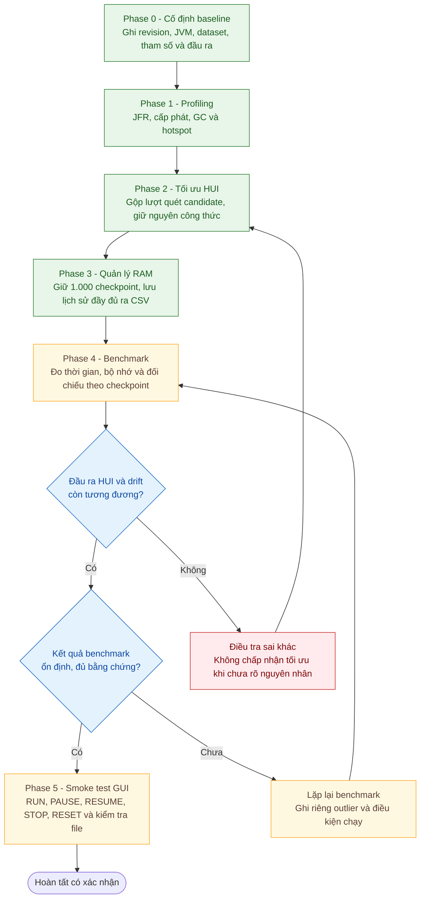

# HUDD-TDS: Hệ Thống Giám Sát Trôi Dạt Độ Lợi (Utility Drift Detection)

Hệ thống mô phỏng, khai phá và giám sát sự thay đổi của các tập mục có độ lợi cao (**High Utility Itemsets - HUI**) và phát hiện hiện tượng trôi dạt độ lợi (**Concept / Utility Drift**) trên luồng dữ liệu giao dịch (**Transactional Data Streams**), hiện thực hóa thuật toán nghiên cứu **HUDD-TDS** (*Duong et al., High Utility Drift Detection in Quantitative Data Streams*).

---

## 1. Các Tính Năng Cốt Lõi

- **Khai phá HUI trên cửa sổ trượt**: Duyệt các giao dịch có TID trong khoảng `(currentTid - windowSize, currentTid]`; tính utility đã suy giảm theo thời gian bằng `d(Δt) = 2^(-Δt/2)`.
- **TWU pruning**: Lọc item/candidate bằng upper bound utility đã suy giảm trước khi đánh giá utility đầy đủ; HUI được giữ khi tổng utility đạt `minutil`.
- **Quản lý bộ nhớ stream**: Engine giữ tối đa khoảng `3 × windowSize` giao dịch theo ranh giới TID để hỗ trợ so sánh; miner vẫn chỉ khai phá cửa sổ `windowSize` gần nhất.
- **Giới hạn lịch sử kết quả trong RAM**: Engine và GUI giữ 1.000 checkpoint gần nhất; drift toàn cục duy trì bộ cộng dồn hằng bộ nhớ. Mọi checkpoint/HUI được ghi đầy đủ vào CSV trong `logs/` để xem hoặc xuất sau khi chạy.
- **Global drift**: Theo dõi chuỗi `DIS_HS` giữa các checkpoint, duy trì cut point và kiểm tra chênh lệch thống kê với epsilon; chiều biến thiên được báo là `TĂNG` hoặc `GIẢM`.
- **Local drift**: So sánh utility của hợp các itemset xuất hiện ở hai checkpoint liền kề; itemset vắng mặt ở một checkpoint được xem có utility bằng 0. Alpha được hiệu chỉnh theo Bonferroni trên số giả thuyết.
- **Tầng dữ liệu**: Đọc hai định dạng transaction (SPMF/HUIM và legacy), nạp investment table, dò và kiểm định dataset. `FullBenchmarkSuite` có cấu hình cho 9 dataset, nhưng dataset thực tế khả dụng tùy file hiện diện trên máy.
- **Swing GUI**: Dùng `SwingWorker` cho công việc nền; hiển thị tiến độ/chỉ số, bảng HUI và drift, log, biểu đồ, lọc bảng và xuất báo cáo. Giao diện đăng ký nhận event từ application service; `SwingWorker` vẫn phụ trách concurrency và cập nhật component trên EDT.
- **Bốn mẫu thiết kế**: `HUDD_TDS` nhận miner và hai drift strategy qua interface; `SimulationService` phát event có kiểu với subscription có thể đóng; GUI dùng `SimulationFacade` cho dataset, tạo service và xuất CSV; các Builder gom cấu hình mô phỏng, engine và event.

---

## 2. Kiến Trúc Hệ Thống Hiện Tại

Phần này mô tả **dependency và cách thực thi trong mã nguồn hiện tại**, không
phải kiến trúc đích sau refactor. Mũi tên `A → B` có nghĩa là mã của `A` gọi,
khởi tạo, hoặc dùng kiểu dữ liệu của `B`.

### 2.1. Cấu trúc thư mục

```text
2312718_BTH01/
├── data/
│   ├── running_example.txt
│   └── datasets/                       # Các thư mục dataset và metadata
├── docs/
│   ├── README.md                       # Mục lục tài liệu hệ thống
│   ├── architecture.md                 # Kiến trúc và dependency
│   ├── design-patterns.md              # Strategy, Observer, Facade và Builder
│   ├── design-patterns-presentation.md # Kịch bản trình bày chi tiết các mẫu
│   ├── Facade_Pattern_Explanation.md   # Phạm vi và cách dùng Facade hiện tại
│   ├── Builder_Pattern_Explanation.md  # Phạm vi và cách dùng Builder hiện tại
│   ├── algorithm-and-data-flow.md      # Thuật toán và luồng transaction
│   ├── event-and-gui-flow.md           # Luồng sự kiện, GUI, EDT và giới hạn kiểm thử
│   ├── validation-and-baseline.md      # Kiểm thử, benchmark, baseline, xác minh cuối
│   └── baseline/                       # Hồ sơ build/test/regression
├── logs/                               # Log chạy GUI và benchmark
├── out/                                # Java class files đã biên dịch
├── src/huddtds/
│   ├── model/
│   │   ├── Element.java
│   │   ├── Transaction.java
│   │   ├── HighUtilityItemset.java
│   │   ├── Checkpoint.java
│   │   ├── ItemsetVector.java
│   │   └── DriftResult.java
│   ├── data/
│   │   ├── TransactionParser.java
│   │   ├── InvestmentLoader.java
│   │   ├── DatasetInfo.java
│   │   ├── DatasetValidator.java
│   │   └── DatasetManager.java
│   ├── math/
│   │   └── UtilityMetrics.java
│   ├── algorithm/
│   │   ├── HUDD_TDS.java
│   │   ├── HUIDiscovery.java
│   │   ├── GlobalDriftDetector.java
│   │   ├── LocalDriftDetector.java
│   │   ├── mining/HUIItemsetMiner.java
│   │   └── drift/
│   │       ├── GlobalDriftStrategy.java
│   │       └── LocalDriftStrategy.java
│   ├── application/
│   │   ├── DatasetService.java
│   │   ├── SimulationService.java
│   │   ├── SimulationConfiguration.java
│   │   ├── CheckpointHistoryWriter.java
│   │   ├── facade/SimulationFacade.java
│   │   └── event/
│   │       ├── EventType.java
│   │       ├── SimulationEvent.java
│   │       └── SimulationListener.java
│   └── demo/
│       ├── HUDD_TDS_GUI.java
│       ├── ChartPanel.java
│       └── DemoRunner.java
└── test/
    ├── BaselineRunner.java
    ├── DataLayerTest.java
    ├── DriftPairBenchmark.java
    ├── EndToEndChessRunner.java
    ├── FinalValidationSuite.java
    ├── FullBenchmarkSuite.java
    ├── StrategyInjectionTest.java
    ├── SimulationServiceEventTest.java
    ├── FacadePatternTest.java
    ├── BuilderPatternTest.java
    ├── ChartPanelTest.java
    ├── DatasetServiceTest.java
    ├── GlobalDriftDetectorStateTest.java
    ├── CheckpointRetentionTest.java
    └── CheckpointHistoryWriterTest.java
```

`DatasetManager` tìm dataset trong `data/datasets/`, thư mục
`Dataset-metadata (CapNhat 14-02)`, thư mục hiện tại và thư mục cha. Vì vậy số
dataset có thể tìm thấy phụ thuộc các thư mục thực tế trên máy, không chỉ vào
các tên được liệt kê trong README.

### 2.2. Dependency hiện tại

```text
demo.HUDD_TDS_GUI
 ├── application.facade: SimulationFacade
 ├── application: SimulationService, SimulationEvent, SimulationListener
 ├── model: Transaction, Checkpoint, HighUtilityItemset, DriftResult
 ├── demo: ChartPanel
 └── Java Swing / SwingWorker

application.DatasetService
 └── data: DatasetManager, DatasetValidator, InvestmentLoader

application.SimulationService
 ├── algorithm: HUDD_TDS
 ├── data: TransactionParser
 ├── math: UtilityMetrics
 └── model: Transaction, Checkpoint, DriftResult, ItemsetVector

demo.DemoRunner ──> algorithm.HUDD_TDS
                         ├──> HUIItemsetMiner <── HUIDiscovery
                         ├──> GlobalDriftStrategy <── GlobalDriftDetector
                         └──> LocalDriftStrategy <── LocalDriftDetector

HUIDiscovery ───────────────────────────────> math.UtilityMetrics
GlobalDriftDetector ────────────────────────> math.UtilityMetrics
LocalDriftDetector ─────────────────────────> math.UtilityMetrics
GlobalDriftStrategy / LocalDriftStrategy ───> model.DriftResult

data.DatasetManager ──> DatasetInfo
                    └─> InvestmentLoader
data.DatasetValidator ──> TransactionParser ──> model.Transaction ──> Element

math.UtilityMetrics ──> model.HighUtilityItemset
                   └─> model.ItemsetVector
model.Transaction ──> model.Element
model.Checkpoint ──> model.HighUtilityItemset
```

Các package là cách tổ chức mã, **không tạo thành các module độc lập với
interface ở mọi ranh giới**. Một vài đặc điểm quan trọng của dependency thực tế:

```text
Presentation
HUDD_TDS_GUI ──> SimulationFacade ──> DatasetService ──> DatasetManager / DatasetValidator / InvestmentLoader
        │                     └────> SimulationService ──> TransactionParser ──> HUDD_TDS
        └── SimulationListener <──────────────────────── SimulationService
                 └── SwingWorker.process() ──> Swing
                                                                  │
                                                ┌─────────────────┼──────────────────┐
                                                ▼                 ▼                  ▼
                                         HUIItemsetMiner   GlobalDriftStrategy  LocalDriftStrategy
                                                ▲                 ▲                  ▲
                                          HUIDiscovery     GlobalDriftDetector  LocalDriftDetector
                                                └─────────────────┼──────────────────┘
                                                                  ▼
                                                      UtilityMetrics / Domain models
```

- `HUDD_TDS` điều phối bộ nhớ stream/checkpoint và giữ reference tới các strategy
  interface `HUIItemsetMiner`, `GlobalDriftStrategy` và `LocalDriftStrategy`.
  Constructor cũ vẫn tạo implementation mặc định; constructor injection mới cho
  phép thay từng strategy mà không đổi orchestration.
- `HUIDiscovery` thực hiện lọc TWU có decay, sinh candidate, pruning, tính utility
  và D_mo; nó gọi `UtilityMetrics`.
- `GlobalDriftDetector` duy trì số lượng quan sát, tổng cộng dồn và tổng tại
  cut point thay vì giữ toàn bộ chuỗi khoảng cách trong RAM; các trung bình và
  phép kiểm định vẫn dùng cùng thứ tự cộng. Strategy trả `DriftResult`; API
  `updateAndCheck(double)` cũ vẫn trả hướng dạng chuỗi để tương thích.
- `LocalDriftDetector` so sánh các HUI giữa hai checkpoint, áp dụng Bonferroni và
  trả `DriftResult` qua strategy; API `detect(List<Checkpoint>)` cũ vẫn trả key
  itemset dạng chuỗi hoặc `null`.
- `SimulationService` là application boundary cho GUI: nhận dòng giao dịch,
  parse và gửi vào engine, lấy drift result có kiểu, chuẩn bị vector hiển thị, rồi
  phát `SimulationEvent` cho listener. `SwingWorker` vẫn giữ vai trò chạy nền;
  callback `process()` vẫn là nơi cập nhật Swing trên EDT.
- `DatasetService` gom discovery, validation, investment loading và mở stream
  vào application API để GUI không gọi trực tiếp các lớp `data`.
- `UtilityMetrics` không hoàn toàn độc lập với Domain: các phép tính D_mo và tạo
  vector nhận/trả `HighUtilityItemset` và `ItemsetVector`.
- `DatasetManager` là lớp cụ thể làm registry/loader cho filesystem; chưa có
  repository interface. `TransactionParser` và `InvestmentLoader` cung cấp
  phương thức static, không được tiêm qua abstraction.
- Các method tương thích `HUDD_TDS.checkGlobalDrift()` và
  `checkLocalDrift()` vẫn trả `String`/`null`; các method `*Result()` cung cấp
  kết quả có kiểu `DriftResult`.
- GUI gọi `SimulationFacade` cho các thao tác dataset/mô phỏng chính; nó vẫn
  nhận `SimulationService` và event để đăng ký observer. Các lớp data, parser,
  investment loader, engine và math nằm phía sau application boundary.
- Đây là application boundary ở mức service, chưa phải kiến trúc module/ports-and-adapters:
  `DatasetService` vẫn gọi trực tiếp `DatasetManager`, validator và loader; parser
  cùng `UtilityMetrics` còn có API static. Chưa có Repository/Factory abstraction.

### 2.3. Các tầng, trách nhiệm và phụ thuộc từng lớp

Các tầng dưới đây là cách đọc trách nhiệm trong source, không phải các Java
module tách biệt. Luồng runtime đi từ GUI qua application services; data,
parser, math và engine được gọi từ bên trong các service đó.

| Tầng / lớp                                            | Trách nhiệm theo source                                                                                                       | Phụ thuộc nội bộ chính                                                                                             | Pattern / ghi chú                                                                                                        |
| ------------------------------------------------------- | ------------------------------------------------------------------------------------------------------------------------------- | ----------------------------------------------------------------------------------------------------------------------- | ------------------------------------------------------------------------------------------------------------------------- |
| **Presentation — `demo.HUDD_TDS_GUI`**         | Xây dựng Swing UI; nhận event để cập nhật bảng, chart, log, summary; khởi tạo`SimulationWorker`.                    | `SimulationFacade`, `SimulationService`, `SimulationEvent`, model payload, `ChartPanel`.                        | Gọi Facade; Observer subscriber; dùng`SwingWorker` để chạy nền và đưa cập nhật về EDT.                      |
| `demo.ChartPanel`                                     | Vẽ checkpoint theo DISHS hoặc số HUI, đánh dấu global drift và cung cấp tooltip.                                        | `Checkpoint`, Swing/AWT.                                                                                              | Component presentation.                                                                                                   |
| `demo.DemoRunner`                                     | Tạo stream mẫu quantity-based, gọi engine và in checkpoint/HUI/drift.                                                       | `HUDD_TDS`, `Transaction`, `Checkpoint`, `HighUtilityItemset`.                                                  | CLI/demo entry point.                                                                                                     |
| **Application — `application.DatasetService`** | Cung cấp dataset names, validation summary, investment map, transaction reader và ước lượng kích thước.                | `DatasetManager`, `DatasetValidator`, `InvestmentLoader`, `DatasetInfo`.                                        | Application service; bọc implementation data cụ thể, chưa phải repository port.                                      |
| `application.SimulationService`                       | Parse transaction line, điều phối engine, chuẩn bị vector hiển thị và phát simulation events.                          | `HUDD_TDS`, `TransactionParser`, `UtilityMetrics`, model, event API.                                              | Application service + Observer publisher; listener dùng danh sách thread-safe`CopyOnWriteArrayList`.                  |
| `application.facade.SimulationFacade`                 | Cung cấp API gọn cho GUI để discovery/validation dataset, tạo simulation service, mở stream và ước lượng giao dịch. | `DatasetService`, `SimulationService`, `HUDD_TDS`.                                                                | Facade tầng ứng dụng; GUI sử dụng trực tiếp, không thay thế các service.                                        |
| `application.event.EventType`                         | Phân loại transaction progress, checkpoint, global/local drift, finish và error.                                             | Không có.                                                                                                             | Typed event discriminator.                                                                                                |
| `application.event.SimulationEvent`                   | Gói TID, transaction/checkpoint, kết quả drift, vector hiển thị, tiến độ và thông báo.                               | `Transaction`, `Checkpoint`, `DriftResult`.                                                                       | Event payload; không phụ thuộc Swing.                                                                                  |
| `application.event.SimulationListener`                | Contract`onUpdate` cho subscriber của simulation service.                                                                    | `SimulationEvent`.                                                                                                    | Observer interface.                                                                                                       |
| **Algorithm — `algorithm.HUDD_TDS`**           | Giữ transaction memory, tạo checkpoint theo interval, gọi HUI/drift strategies và cộng D_mo thành DIS_HS.                 | `Transaction`, `Checkpoint`, `DriftResult`, `HUIItemsetMiner`, `GlobalDriftStrategy`, `LocalDriftStrategy`. | Bộ điều phối thuật toán; constructor mặc định giữ compatibility, constructor khác cho phép inject strategies. |
| `algorithm.mining.HUIItemsetMiner`                    | Contract khai phá HUI từ retained memory và TID hiện tại; nhận trace listener.                                            | `Transaction`, `HighUtilityItemset`, `Consumer<String>`.                                                          | Strategy interface; default implementation là`HUIDiscovery`.                                                           |
| `algorithm.HUIDiscovery`                              | Lọc promising items bằng TWU có decay, sinh/prune candidate và tính utility/D_mo.                                          | `HUIItemsetMiner`, `UtilityMetrics`, `Transaction`, `Element`, `HighUtilityItemset`.                          | Concrete HUI Strategy;`maxItemsetSize` giới hạn độ sâu duyệt.                                                     |
| `algorithm.drift.GlobalDriftStrategy`                 | Stateful contract nhận một observation DIS_HS và trả`DriftResult`.                                                        | `DriftResult`, `Consumer<String>`.                                                                                  | Strategy interface; default implementation là`GlobalDriftDetector`.                                                    |
| `algorithm.GlobalDriftDetector`                       | Duy trì bộ cộng dồn hằng bộ nhớ/cut point, tính Hoeffding bounds và kiểm định thay đổi global.                    | `GlobalDriftStrategy`, `UtilityMetrics`, `DriftResult`.                                                           | Concrete Strategy; giữ overload chuỗi cũ`updateAndCheck(double)`.                                                    |
| `algorithm.drift.LocalDriftStrategy`                  | Contract so sánh hai checkpoint và trả`DriftResult`.                                                                       | `Checkpoint`, `DriftResult`, `Consumer<String>`.                                                                  | Strategy interface; default implementation là`LocalDriftDetector`.                                                     |
| `algorithm.LocalDriftDetector`                        | So sánh utility itemsets giữa hai checkpoint, dùng Bonferroni và trả itemset đầu tiên vượt ngưỡng.                  | `LocalDriftStrategy`, `UtilityMetrics`, `Checkpoint`, `HighUtilityItemset`, `DriftResult`.                    | Concrete Strategy; giữ overload chuỗi cũ`detect(List<Checkpoint>)`.                                                  |
| **Math — `math.UtilityMetrics`**               | Cung cấp decay, Hoeffding/Bonferroni, epsilon drift, variance, D_mo và vector construction.                                   | `HighUtilityItemset`, `ItemsetVector`.                                                                              | Utility class static; math layer tham chiếu model.                                                                       |
| **Data — `data.TransactionParser`**            | Parse một dòng thành`Transaction` theo SPMF/HUIM hoặc legacy format.                                                      | `Transaction`, `Element`.                                                                                           | Parser static; hiện chưa có Strategy riêng theo format.                                                               |
| `data.InvestmentLoader`                               | Đọc investment file thành`Map<String, Double>`.                                                                            | Java I/O.                                                                                                               | Static loader; dòng có giá trị không hợp lệ được diagnostic và bỏ qua.                                        |
| `data.DatasetInfo`                                    | Lưu tên dataset, file transaction/investment và metadata liên quan.                                                         | Java`File`.                                                                                                           | Metadata model.                                                                                                           |
| `data.DatasetManager`                                 | Quét dataset directories, cung cấp metadata, mở transaction stream và nạp investment.                                      | `DatasetInfo`, `InvestmentLoader`.                                                                                  | Concrete filesystem manager; chưa có Repository interface.                                                              |
| `data.DatasetValidator`                               | Parse và thống kê transaction, item, TU, investment; trả`ValidationReport`.                                               | `Element`, `Transaction`, `TransactionParser`, `InvestmentLoader`.                                              | Validator;`passed` hiện dựa trên có transaction hợp lệ và không có transaction parse lỗi.                     |
| **Domain — `model.Element`**                   | Lưu item, quantity và/hoặc direct utility; hỗ trợ quantity-based và utility-based data.                                   | Không có.                                                                                                             | Domain model.                                                                                                             |
| `model.Transaction`                                   | Lưu TID, elements, tra cứu element theo item và tính TU theo dữ liệu/external utility.                                    | `Element`.                                                                                                            | Domain entity;`elementMap` cho lookup item.                                                                             |
| `model.HighUtilityItemset`                            | Lưu itemset, utility từng item, total utility và distance tới root.                                                         | Collection types.                                                                                                       | Domain model.                                                                                                             |
| `model.Checkpoint`                                    | Lưu TID, danh sách HUI và global distance tại một checkpoint.                                                              | `HighUtilityItemset`.                                                                                                 | Domain snapshot.                                                                                                          |
| `model.ItemsetVector`                                 | Lưu vector utility theo dimensions.                                                                                            | Collection types.                                                                                                       | Value object cho phép tính/hiển thị vector.                                                                           |
| `model.DriftResult`                                   | Lưu detected/type, checkpoint TIDs, statistic, threshold, description/direction và affected itemsets.                         | Không có.                                                                                                             | Kết quả drift có kiểu; engine vẫn giữ API chuỗi/`null` để tương thích.                                      |

Các lớp `test.*` độc lập dùng `main`, không phải JUnit:

| Runner                         | Phạm vi                                                                                                   | Phụ thuộc chính                                                                     |
| ------------------------------ | ---------------------------------------------------------------------------------------------------------- | -------------------------------------------------------------------------------------- |
| `BaselineRunner`             | Chạy running example và in checkpoint/HUI/drift.                                                         | `HUDD_TDS`, model.                                                                   |
| `DataLayerTest`              | Kiểm tra parser, investment loader, dataset discovery và validator.                                      | Các lớp`data`, `Transaction`.                                                    |
| `FinalValidationSuite`       | Kiểm tra biên công thức, parser, loader và validator.                                                 | `DatasetValidator`, `InvestmentLoader`, `TransactionParser`, `UtilityMetrics`. |
| `StrategyInjectionTest`      | Kiểm tra constructor injection, delegation và chuỗi legacy.                                             | `HUDD_TDS`, ba strategy interfaces, `DriftResult`.                                 |
| `SimulationServiceEventTest` | Kiểm tra event checkpoint/progress/drift/finish/error và listener removal.                               | `SimulationService`, event API, fake strategies.                                     |
| `FacadePatternTest`          | Kiểm tra truy cập dataset, tạo service, xử lý giao dịch, event checkpoint và mở stream qua Facade. | `SimulationFacade`, `SimulationService`, event API.                                |
| `ChartPanelTest`             | Kiểm tra thứ tự TID số, tọa độ trục X, log1p và điều kiện đánh dấu global drift.            | `ChartPanel`, `Checkpoint`, `DriftResult`.                                       |
| `GlobalDriftDetectorStateTest` | Đối chiếu detector cộng dồn với implementation tham chiếu trên 2.500 observation và kiểm tra reset. | `GlobalDriftDetector`, `UtilityMetrics`, `DriftResult`. |
| `CheckpointRetentionTest` | Xác nhận engine chỉ giữ 1.000 checkpoint gần nhất. | `HUDD_TDS`, miner và drift strategies. |
| `CheckpointHistoryWriterTest` | Kiểm tra CSV writer, escape trường và checkpoint không có HUI. | `CheckpointHistoryWriter`, event/model. |
| `DatasetServiceTest`         | Kiểm tra discovery, investment, stream, estimate và validation application API.                          | `DatasetService`.                                                                    |
| `DriftPairBenchmark`         | Nối Chess/NewChess và Mushrooms/NewMushroom để khảo sát drift.                                       | `HUDD_TDS`, data API, model.                                                         |
| `EndToEndChessRunner`        | Chạy pipeline trên dataset Chess.                                                                        | `HUDD_TDS`, data API, model.                                                         |
| `FullBenchmarkSuite`         | Benchmark cấu hình trên nhiều dataset và ghi log.                                                     | `HUDD_TDS`, data API, model.                                                         |

Thông tin source inventory và dependency này được đặt tập trung trong README để
không cần duy trì một bản `CLASS_INVENTORY.md` riêng.

### 2.4. Luồng xử lý dữ liệu

**GUI với dataset/file**

```text
Người dùng chọn dataset, file ngoài hoặc dữ liệu nhập tay
        │
        ├── DatasetService (dataset, investment, stream, validation)
        └── SimulationService.processLine(line, tid)
                ├── TransactionParser.parseLine(...)
                ├── HUDD_TDS.processTransaction(tx)
                ├── lấy Global/Local DriftResult
                ├── chuẩn bị vector HUI cho presentation
                └── phát event
                         │
              SimulationListener → SwingWorker.publish(...)
                         │
              SwingWorker.process() cập nhật Swing UI
```

GUI dùng `SwingWorker` để chạy công việc đọc/parse/engine trong nền. Observer
event là API nghiệp vụ giữa application service và UI; `SwingWorker.process()`
vẫn cập nhật widget trên luồng Swing EDT. Trace log tiếp tục được phát qua
`Consumer<String>` và hiển thị/ghi file riêng.

**Demo dòng lệnh**

```text
DemoRunner tự tạo Transaction(quantity-based)
        → HUDD_TDS
        → in checkpoint, HUI, global/local drift ra console
```

### 2.5. Cấu hình và hành vi runtime

`HUDD_TDS_GUI` đưa các tham số sau vào `SimulationService`/`HUDD_TDS`:

| Tham số           | Ý nghĩa theo mã nguồn                                                                                         |
| ------------------ | ----------------------------------------------------------------------------------------------------------------- |
| `MinUtil`        | Ngưỡng utility tối thiểu dùng khi lọc TWU và xác nhận HUI.                                               |
| `Interval`       | Sinh checkpoint khi`TID % interval == 0`; không sinh checkpoint ở các TID khác.                             |
| `Window`         | Số TID gần nhất được miner dùng để khai phá HUI.                                                        |
| `Alpha`          | Mức ý nghĩa truyền cho global/local drift detectors.                                                          |
| `Max Len`        | Giới hạn độ dài itemset; giá trị`<= 0` làm miner không áp giới hạn độ dài.                       |
| `Max Tx`         | `0` nghĩa là đọc hết stream; số dương giới hạn số transaction được xử lý.                       |
| `Tốc độ trễ` | Mỗi transaction đã xử lý có thể chờ 0–200 ms;`0` chạy nhanh nhất, không phải giới hạn tốc độ. |

Các giá trị ban đầu trên form là `MinUtil=15.0`, `Interval=1`, `Window=2`,
`Alpha=0.10`, `Max Len=3`, `Max Tx=0`, độ trễ `0 ms`. Khi người dùng chọn
dataset có tên khớp các profile trong GUI, các trường được gợi ý như sau; người
dùng vẫn có thể chỉnh lại:

| Profile tên dataset |   MinUtil | Interval | Window | Alpha | Max Len |
| -------------------- | --------: | -------: | -----: | ----: | ------: |
| Running Example      |        15 |        1 |      2 |  0.10 |       4 |
| Chess                | 2,000,000 |      300 |    500 |  0.05 |       3 |
| Mushroom             | 2,500,000 |      500 |  1,000 |  0.05 |       3 |
| Connect              | 3,000,000 |    1,000 |  2,000 |  0.05 |       3 |
| Retail               |   100,000 |    1,000 |  2,000 |  0.05 |       3 |
| Accident             | 5,000,000 |    2,000 |  5,000 |  0.05 |       3 |
| Chainstore           |   500,000 |    5,000 | 10,000 |  0.05 |       3 |

Profile được chọn bằng cách kiểm tra chuỗi tên dataset; đây là preset giao diện,
không phải metadata đọc từ file dataset. GUI kiểm tra khả năng parse số nguyên/số
thực nhưng không xác thực đầy đủ miền giá trị ngay trong form. Khi tạo cấu hình,
`SimulationConfiguration.Builder` và `HUDD_TDS.Builder` từ chối `minutil` âm
hoặc không hữu hạn, `interval`/`windowSize` không dương, alpha ngoài `(0,1)` và
`maxItemsetSize` âm. API constructor tương thích cũ của engine không đi qua
toàn bộ validation này.

Chi tiết chu trình xử lý:

1. `DatasetService` cung cấp tên dataset, validation, investment map và reader.
   File tùy chỉnh được chọn qua file chooser; GUI tự tìm `investment_table.txt`
   cạnh transaction file, nếu không thấy thì hỏi người dùng có chọn file riêng
   hay không.
2. `SimulationService.processLine(line, tid)` parse dòng thành `Transaction`,
   gọi `HUDD_TDS.processTransaction()` và chỉ phát checkpoint event khi engine
   tạo checkpoint.
3. Tại checkpoint, engine khai phá HUI, tính `D_mo` cho từng HUI và cộng các
   khoảng cách này thành `DIS_HS` (`Checkpoint.globalDistance`).
4. Với từ hai checkpoint trở lên, application service yêu cầu global và local
   strategy đánh giá hai checkpoint gần nhất. Event `CHECKPOINT_CREATED` mang
   checkpoint cùng hai kết quả; khi có drift, service phát thêm event
   `GLOBAL_DRIFT` và/hoặc `LOCAL_DRIFT`.
5. `TRANSACTION_PROCESSED` dùng cho tiến độ (GUI phát theo checkpoint hoặc mỗi
   100 TID), `SIMULATION_FINISHED` báo hoàn tất, và `SIMULATION_ERROR` chuyển
   thông tin lỗi. Event không trực tiếp cập nhật Swing: listener của GUI gọi
   `SwingWorker.publish()`, sau đó `process()` cập nhật UI trên EDT.

### 2.6. Quy tắc tính metric và drift

- Với itemset có `k` item và vector utility đã suy giảm `x`, `D_mo` được tính từ
  độ tương đồng góc với root vector (mọi chiều bằng 1) kết hợp chênh lệch độ
  lớn vector. Mã nguồn trả `0` nếu itemset rỗng hoặc norm bằng 0; nếu không:
  `normX = sqrt(Σ xᵢ²)`, `normRoot = sqrt(k)`,
  `sCos = Σxᵢ / (normX × normRoot)`,
  `sMo = sCos × (1 - |normX - normRoot| / max(normX, normRoot))`,
  `D_mo = max(0, 1 - sMo)`.
- `DIS_HS` của checkpoint là tổng `D_mo` của toàn bộ HUI được khai phá tại
  checkpoint đó; không phải trung bình.
- Global detector thêm một observation `DIS_HS` cho mỗi lần kiểm tra sau
  checkpoint đầu. Với `n` observation và cut point `m`, epsilon trong
  `UtilityMetrics` là
  `sqrt((n-m)/(2nm) × ln(2/alpha)) × abs(range)`. Engine mặc định khởi tạo
  global strategy với `range=1.0`; detector dùng các Hoeffding bounds để cập
  nhật cut point/trend và so `|Udrift - V|` với epsilon để quyết định drift.
- Local detector kiểm tra hợp các HUI giữa hai checkpoint gần nhất. Utility
  itemset không xuất hiện ở checkpoint được đặt bằng `0`; mỗi utility được so
  với utility cùng itemset ở checkpoint kia. Mã nguồn dùng `windowSize` làm
  sample size cho mỗi phía, hiệu chỉnh `alpha` thành `alpha / hypothesisCount`
  và áp dụng `localDriftEpsilon` cho phương sai của cặp giá trị. Detector trả
  kết quả ở itemset đầu tiên vượt ngưỡng.

Đây là mô tả phép tính thực tế trong source, không khẳng định mọi chi tiết cài
đặt trùng hoàn toàn với bài báo gốc hoặc một implementation khác.

### 2.7. Runner kiểm thử và benchmark

Các class trong `test` là chương trình độc lập có `main`, không phải test class
của JUnit:

| Class                          | Phạm vi                                                                                                |
| ------------------------------ | ------------------------------------------------------------------------------------------------------- |
| `BaselineRunner`             | Đọc`data/running_example.txt` và in checkpoint/HUI/drift để làm điểm đối chiếu thủ công. |
| `DataLayerTest`              | Kiểm tra parser hai định dạng, investment loader, dataset discovery và validation trên dataset.   |
| `FinalValidationSuite`       | Chạy các ca biên cho công thức, parser, loader và validator.                                      |
| `SimulationServiceEventTest` | Kiểm tra checkpoint/progress/drift/completion/error events và listener removal.                       |
| `DatasetServiceTest`         | Kiểm tra dataset discovery, investment load, stream, estimate và validation qua application API.      |
| `DriftPairBenchmark`         | Nối từng cặp Chess/NewChess và Mushrooms/NewMushroom để khảo sát drift khi chuyển pha.         |
| `EndToEndChessRunner`        | Chạy pipeline trên dataset Chess và in kết quả checkpoint.                                         |
| `FullBenchmarkSuite`         | Chạy benchmark cấu hình sẵn trên nhiều dataset và ghi log tổng hợp.                            |

Các runner cần được biên dịch trước khi chạy. Cần kiểm tra exit code và đầu ra
thực tế; tên class hoặc dòng chữ `PASSED` trong log không tự xác nhận toàn bộ
suite đã được chạy trong môi trường hiện tại. Hồ sơ kết quả baseline nằm tại
[docs/baseline/](./docs/baseline/).

### 2.8. Bốn mẫu thiết kế được áp dụng trực tiếp

Trong source hiện tại, bốn pattern giải quyết bốn trách nhiệm khác nhau:

| Pattern            | Vấn đề được giải quyết                                                                                               | Vị trí trong mã                                                                                                |
| ------------------ | ---------------------------------------------------------------------------------------------------------------------------- | ----------------------------------------------------------------------------------------------------------------- |
| **Strategy** | Tách lựa chọn thuật toán khai phá HUI và phát hiện drift khỏi bộ điều phối stream.                             | `HUDD_TDS` nhận ba strategy interfaces qua constructor/builder.                                                |
| **Observer** | Tách nơi phát kết quả khỏi GUI; quản lý vòng đời subscription và báo lỗi listener rõ ràng. | `SimulationService` phát `SimulationEvent`; listener của GUI chuyển event đến `SwingWorker.process()`. |
| **Facade**   | Cung cấp điểm truy cập gọn cho các thao tác dataset và khởi tạo mô phỏng mà GUI cần.                           | `SimulationFacade` phối hợp `DatasetService` và `SimulationService`; GUI gọi Facade.                    |
| **Builder**  | Gom cấu hình mô phỏng/event và kiểm tra tham số cùng payload cốt yếu. | `SimulationConfiguration.Builder`, `HUDD_TDS.Builder`, `SimulationEvent.Builder`. |

#### 2.8.1. Strategy Pattern — thay thế thuật toán qua contract

`HUDD_TDS` là orchestrator: nó quản lý transaction memory, quyết định thời
điểm checkpoint, gọi thuật toán khai phá HUI và yêu cầu drift detectors kiểm
tra kết quả. Thay vì giữ dependency bắt buộc vào ba lớp triển khai cụ thể,
engine lưu các contract:

- `HUIItemsetMiner.discover(memory, currentTid)` cho HUI mining;
- `GlobalDriftStrategy.updateAndCheck(observation, oldTid, newTid)` cho global
  drift; strategy này có trạng thái lịch sử/cut point;
- `LocalDriftStrategy.detect(previousCheckpoint, currentCheckpoint)` cho local
  drift.

Các implementation mặc định là `HUIDiscovery`, `GlobalDriftDetector` và
`LocalDriftDetector`. Constructor thông thường của `HUDD_TDS` tự tạo các
implementation mặc định; constructor nhận các interface cho phép caller inject
implementation khác:

```text
HUDD_TDS
  ├── HUIItemsetMiner       ← HUIDiscovery (mặc định)
  ├── GlobalDriftStrategy   ← GlobalDriftDetector (mặc định)
  └── LocalDriftStrategy    ← LocalDriftDetector (mặc định)
```

Nhờ vậy, `HUDD_TDS` tiếp tục sở hữu orchestration nhưng không cần biết chi tiết
candidate generation hay phép kiểm định cụ thể của từng detector. Các strategy
trả `DriftResult` thay vì buộc caller phải suy luận kết quả từ chuỗi. API legacy
được giữ để tương thích: `HUDD_TDS.checkGlobalDrift()` /
`checkLocalDrift()` vẫn trả `String` hoặc `null`; detector cũng còn overload
chuỗi tương ứng.

Để thêm một biến thể thuật toán, implement contract tương ứng rồi truyền instance
vào constructor injection hoặc Builder của `HUDD_TDS`; không cần sửa luồng quản lý
transaction và checkpoint trong engine. Strategy không thay đổi mặc định nào được dùng nếu
caller khởi tạo engine bằng constructor tương thích cũ.

#### 2.8.2. Observer Pattern — phát sự kiện mô phỏng tới subscribers

`SimulationService` là publisher. Nó giữ danh sách `SimulationListener` trong
`CopyOnWriteArrayList`, cung cấp `addListener()` / `removeListener()` và
`subscribe()`. `subscribe()` trả về `Subscription` (`AutoCloseable`) để gỡ
listener idempotent; GUI đóng subscription trong `SwingWorker.done()`. Event
type là enum `EventType`; payload được đóng gói trong `SimulationEvent`
(khởi tạo qua `SimulationEvent.Builder`), với trường phù hợp như TID,
transaction/checkpoint, `DriftResult`, vector hiển thị, tiến độ hoặc thông báo.
Listener và event không phụ thuộc Swing.

Callback chạy đồng bộ trên luồng phát event. Nếu một listener ném
`RuntimeException`, service vẫn dispatch event tới các listener tiếp theo rồi
ném lại lỗi đầu tiên; các lỗi listener tiếp theo được gắn dưới dạng
suppressed exception. Vì vậy lỗi callback không bị bỏ qua hoặc chuyển thành
kết quả thành công.

Các event trong luồng hiện tại:

| Event                     | Nơi phát                                                                                    | Nội dung / mục đích                                                                          |
| ------------------------- | --------------------------------------------------------------------------------------------- | ------------------------------------------------------------------------------------------------ |
| `CHECKPOINT_CREATED`    | `SimulationService.processLine()` sau khi engine tạo checkpoint và tính kết quả drift. | Checkpoint, transaction, kết quả global/local và dữ liệu vector để GUI dựng bảng/chart. |
| `GLOBAL_DRIFT`          | `SimulationService.processLine()` khi global result được phát hiện.                    | Kết quả drift toàn cục có kiểu và thông báo hiển thị.                                 |
| `LOCAL_DRIFT`           | `SimulationService.processLine()` khi local result được phát hiện.                     | Kết quả drift cục bộ và itemset bị ảnh hưởng.                                           |
| `TRANSACTION_PROCESSED` | `SimulationWorker` qua `publishProgress()`.                                               | TID/ước lượng tổng số dòng/tốc độ để cập nhật tiến độ.                          |
| `SIMULATION_FINISHED`   | `SimulationWorker` khi stream kết thúc bình thường.                                    | Thông báo kết thúc mô phỏng.                                                               |
| `SIMULATION_ERROR`      | `SimulationWorker` khi xử lý gặp lỗi.                                                   | Thông tin lỗi để subscriber cập nhật trạng thái/nhật ký.                               |

Subscriber hiện tại là listener được `HUDD_TDS_GUI.SimulationWorker` đăng ký.
Listener gọi `SwingWorker.publish()` để chuyển event khỏi luồng nền; phương thức
`process()` nhận các event và cập nhật Swing components trên Event Dispatch
Thread:

```text
SimulationService (publisher, chạy trong SwingWorker background thread)
        │
        └── SimulationListener.onUpdate(SimulationEvent)
                    │
                    └── SwingWorker.publish(...)
                              │
                              └── SwingWorker.process(...) trên EDT
                                         ├── bảng HUI / bảng Drift
                                         ├── metrics / progress / log
                                         └── ChartPanel / summary
```

Observer chỉ giải quyết việc **thông báo kết quả và giảm phụ thuộc giữa
application service với GUI**. Nó không tự tạo thread, pause/resume hoặc hủy
worker. Những việc đó vẫn thuộc `SwingWorker` và `SimulationWorker`; do đó hai
cơ chế bổ sung cho nhau chứ không thay thế nhau.

#### 2.8.3. Facade Pattern — đơn giản hóa truy cập dịch vụ ứng dụng

`SimulationFacade` cung cấp API cho GUI để liệt kê và kiểm định dataset, tạo
`SimulationService`, mở transaction stream, ước lượng số giao dịch và xuất CSV.
GUI gọi Facade cho discovery, validation, tạo service, mở stream, ước lượng và
xuất CSV cho bảng HUI/drift. Cấu hình mô phỏng được gom trong
`SimulationConfiguration.Builder`, bao gồm các Strategy tùy chọn để Facade
chuyển vào `HUDD_TDS.Builder`. CSV được ghi UTF-8, quote từng ô, escape dấu
ngoặc kép và chuyển giá trị `null` thành ô rỗng; overload có `title` chỉ giữ
tương thích và không ghi title thành dòng CSV. Báo cáo TXT và sao chép
log/history vẫn do GUI đảm nhiệm.

Facade phối hợp các service, không thay thế chúng: `DatasetService` tiếp tục
thực hiện thao tác dataset; `SimulationService` parse và xử lý giao dịch, sau
đó phát event; `HUDD_TDS` điều phối thuật toán và gọi các Strategy. Reader trả
về từ Facade vẫn do caller đóng. `DemoRunner` tiếp tục gọi engine trực tiếp,
nêu Facade hiện được dùng chủ yếu bởi GUI.

`FacadePatternTest` kiểm tra dataset API, tạo service, xử lý giao dịch và nhận
event checkpoint từ service do Facade tạo, cùng việc mở stream Running Example.
Test này chạy độc lập với Swing nhưng không thay thế kiểm thử tương tác GUI.

#### 2.8.4. Builder Pattern — cấu hình đối tượng phức tạp rõ ràng

`SimulationConfiguration`, `HUDD_TDS` và `SimulationEvent` đều có Builder phù
hợp với cấu trúc cấu hình. `SimulationEvent` vẫn giữ constructor vị trí 13 tham số;
các trường payload có thể để mặc định nếu caller không gán.

Mẫu **Builder Pattern** giải quyết bằng cách cung cấp Fluent API:

- **`SimulationConfiguration.Builder`**: Gom dataset, investment file, tham số và các Strategy tùy chọn; xác thực dataset, minutil hữu hạn, interval, window, alpha và giới hạn itemset trước khi tạo cấu hình bất biến.
- **`HUDD_TDS.Builder`**: Có giá trị mặc định cho tham số cấu hình; cung cấp `.withExternalUtilities()`, `.withMinutil()`, `.withInterval()`, `.withWindowSize()`, `.withAlphaConfidence()`, `.withMaxItemsetSize()` và các setter tiêm strategy. Một số setter kiểm tra điều kiện ngay khi gọi; `.build()` không chạy validation tổng quát.
- **`SimulationEvent.Builder`**: Yêu cầu event type, TID không âm, checkpoint cho `CHECKPOINT_CREATED`, kết quả drift đúng loại/đã phát hiện cho event global/local và metadata tiến độ không âm. `itemsetVectors` được sao chép nông thành danh sách không sửa được; model payload không deep-copy. Constructor vị trí 13 tham số vẫn tồn tại nhưng không chạy validation của Builder.

`BuilderPatternTest` kiểm tra cấu hình mặc định/tùy chỉnh, từ chối tham số sai,
snapshot map utility và payload event theo loại; `FacadePatternTest` xác nhận
cấu hình mô phỏng chuyển Strategy tùy chỉnh vào engine.

#### 2.8.5. Kiểm chứng bốn mẫu thiết kế

- `StrategyInjectionTest` kiểm tra engine nhận strategy qua constructor/builder, gọi
  đúng implementation và giữ hành vi API chuỗi tương thích.
- `SimulationServiceEventTest` kiểm tra checkpoint/progress/drift/finish/error
  events và việc hủy đăng ký listener.
- `FacadePatternTest` kiểm tra dataset API, tạo service, Strategy injection,
  event checkpoint và CSV UTF-8/escaping qua Facade.
- `BuilderPatternTest` kiểm tra khởi tạo Engine và Event qua Fluent API cùng validation tham số; `FacadePatternTest` kiểm tra cấu hình mô phỏng.
- `DatasetServiceTest` kiểm tra application service cho thao tác dataset.

Các API Strategy/Observer/Facade/Builder và test tương ứng được mô tả ở đây theo source
hiện tại. Việc có các pattern này không đồng nghĩa toàn hệ thống đã dùng kiến trúc
plug-in/module: `DatasetService` vẫn gọi trực tiếp data implementations;
`TransactionParser` và `UtilityMetrics` còn là utility API; chưa có
Repository/Factory cho nhiều nguồn dữ liệu. `HUDD_TDS` là bộ điều phối thuật
toán, còn `SimulationFacade` là Facade của tầng ứng dụng.

GUI gọi `SimulationFacade` cho các thao tác ứng dụng chính; nó vẫn tham chiếu
kiểu `SimulationService`, event và model để đăng ký listener/trình bày dữ liệu.
Domain không phụ thuộc Swing hay filesystem; math vẫn tham chiếu model trong
phép tính D_mo/vector.

---

## 3. Định dạng dữ liệu

### 3.1. Tệp giao dịch

`TransactionParser.parseLine(line, tid)` hỗ trợ hai dạng sau. Mỗi dòng không
rỗng được gán TID theo thứ tự đọc trong stream; parser hiện không tự bỏ qua
dòng comment trong transaction file.

**SPMF/HUIM utility-based** — ba trường phân tách bằng dấu `:`:

```text
<danh_sách_item>:<tổng_utility_giao_dịch_TU>:<utility_từng_item>
```

Ví dụ:

```text
1 3 5 7:11699429.00:75465.00 118984.00 561780.00 32025.00
```

- Trường 1 là danh sách item cách nhau bởi khoảng trắng.
- Trường 2 là TU được lưu trên `Transaction`.
- Trường 3 chứa utility của từng item theo đúng thứ tự; số lượng item và utility
  phải bằng nhau, mọi trường phải có dữ liệu số hợp lệ.

**Legacy quantity-based** — mỗi token có dạng `item:quantity`, các token cách
nhau bởi khoảng trắng:

```text
a:2 c:6 e:2 g:5
```

Khi tính utility dạng legacy, engine dùng `quantity × externalUtility`; nếu item
không có trong investment map thì external utility mặc định là `1.0`. Với dạng
SPMF, utility từng item được đọc trực tiếp; TU khai báo được dùng làm
transaction utility khi lớn hơn 0.

### 3.2. Thư mục dataset và investment table

Dataset được nhận diện nếu có thư mục con chứa `transactions.txt`. Tên file
investment chuẩn là `investment_table.txt`; thiếu file này không ngăn dataset
được liệt kê, và việc nạp investment khi thiếu file trả map rỗng.
`DatasetManager` quét thư mục con trực tiếp của:

- `data/datasets/` (hoặc `baseDirectory` truyền vào constructor);
- `Dataset-metadata (CapNhat 14-02)/`;
- thư mục làm việc hiện tại;
- thư mục cha của thư mục làm việc.

Các thư mục `src`, `test`, `out`, `bin`, `logs`, `.git`, `.vscode` và `scratch`
bị bỏ qua. Việc quét không đi sâu đệ quy; tên trùng được phân biệt không phân
biệt hoa thường và chỉ đăng ký một dataset cùng tên.

Investment file hỗ trợ dữ liệu theo dòng `ItemID [tab/space] Total Investment`;
dòng trống, header, separator và dòng comment bắt đầu `#` bị bỏ qua. Dòng có
giá trị không parse được bị bỏ qua với diagnostic trên stderr; giá trị âm được
cảnh báo nhưng vẫn được nạp.

### 3.3. Kiểm định dữ liệu

`DatasetValidator` parse transaction, đếm giao dịch hợp lệ/lỗi, item khác nhau,
tổng TU, investment entries và item thiếu investment. TU trong file được so với
tổng utility item với sai số cho phép `0.05`; khác biệt được báo thành warning,
không phải parse error. Validation `passed` trong mã nguồn có nghĩa là có ít
nhất một giao dịch hợp lệ và không có transaction parse lỗi; warning về TU,
investment thiếu hoặc thiếu file investment không tự làm `passed=false`.
GUI gọi validation với giới hạn 5,000 dòng và hiển thị metrics cùng danh sách
errors; `ValidationSummary` của application boundary không chuyển tiếp warnings.
Trong source, cờ `passed` được gán đúng theo điều kiện
`invalidTransactions == 0 && validTransactions > 0`; các lỗi khác được ghi vào
`errors` nhưng không nằm trong biểu thức gán cờ này.

Ví dụ cấu trúc:

```text
data/datasets/Chess/
├── transactions.txt
└── investment_table.txt
```

---

## 4. Hướng Dẫn Biên Dịch & Khởi Chạy

### 4.1. Biên dịch toàn bộ dự án

Mở PowerShell tại thư mục gốc repository. Mã nguồn dùng các tính năng Java hiện
đại (bao gồm text block, pattern matching cho `instanceof` và `Stream.toList()`),
nên cần JDK 16 trở lên:

```powershell
$files = Get-ChildItem -Path src,test -Filter *.java -Recurse |
    ForEach-Object { $_.FullName }
New-Item -ItemType Directory -Force out | Out-Null
javac -encoding UTF-8 -d out $files
if ($LASTEXITCODE -ne 0) { throw 'Build failed' }
```

### 4.2. Khởi chạy Giao diện Swing (GUI)

```powershell
java -cp out huddtds.demo.HUDD_TDS_GUI
```

GUI yêu cầu môi trường desktop có hỗ trợ Swing; chạy được lệnh compile không
đồng nghĩa các thao tác cửa sổ đã được kiểm thử tương tác.

**Các tính năng trên GUI:**

1. **Nguồn dữ liệu**: Chọn dataset đã discover qua `DatasetService`, chọn Running Example nhập tay, hoặc chọn file transaction ngoài. GUI tìm investment file trong cùng thư mục; nếu không có thì hỏi có chọn file riêng hay không.
2. **Giới hạn số giao dịch (`Max Tx`)**: Nhập số giao dịch (ví dụ: `500`, `1000`) để kiểm tra nhanh trong vài giây hoặc nhập `0` để chạy toàn bộ dataset.
3. **Điều khiển phát luồng toàn diện**:
   - **RUN** chạy đọc/parse/engine trên `SwingWorker` nền.
   - **Pause/Resume** chờ worker giữa các dòng; Resume đánh thức worker.
   - **STOP** hủy worker; **Reset** xóa các bảng/chỉ số/chart/log trên giao diện.
   - Slider chèn delay 0–200 ms sau mỗi transaction đã xử lý. Delay `0` không chèn sleep.
4. **Bộ lọc & Tìm kiếm tương tác**:
   - Ô tìm kiếm lọc chuỗi itemset theo literal, không phân biệt hoa thường; ký tự tìm kiếm được quote nên không được diễn giải như regex.
   - Checkbox "Tự động cuộn theo dòng mới".
   - Lọc phân loại sự kiện trong Bảng Drift (Tất cả / Chỉ Global / Chỉ Local).
5. **Đồ thị tương tác (ChartPanel)**:
   - Chuyển đổi linh hoạt giữa 2 chỉ số: *Khoảng cách toàn cục (DISHS)* hoặc *Số lượng HUI*.
   - Sắp xếp checkpoint và bố trí trục X theo TID số tăng dần.
   - Trục Y hiển thị thang `log1p`; nhãn tick và tooltip vẫn ghi giá trị metric gốc.
   - Chỉ checkpoint có `DriftResult` loại global được xác nhận mới đánh dấu đỏ; hover hiển thị statistic và threshold của phép kiểm định.
6. **Nhật ký và export**: Bảng HUI, bảng Drift và chart chỉ giữ tối đa 1.000 checkpoint gần nhất; bộ đếm tổng vẫn tính cả phiên. Menu export có HUI CSV, Drift CSV, summary TXT, process log TXT và toàn bộ lịch sử checkpoint/HUI CSV. Tệp đầy đủ được ghi liên tục trong `logs/`; bảng HUI/Drift chỉ xuất các dòng còn nằm trong model bảng. Bật `Log từng giao dịch` để trace chi tiết.

### 4.3. Chạy runner kiểm thử và benchmark

Các class trong `test` là chương trình `main` độc lập, không phải JUnit. Chạy từ
thư mục gốc sau khi biên dịch:

- **Kiểm tra tầng dữ liệu**:
  ```powershell
  java -cp out test.DataLayerTest
  ```
- **Kiểm tra dữ liệu/công thức ở các trường hợp biên**:
  ```powershell
  java -cp out test.FinalValidationSuite
  ```
- **Smoke test Strategy injection và API tương thích**:
  ```powershell
  java -cp out test.StrategyInjectionTest
  ```
- **Smoke test Observer event và application service**:
  ```powershell
  java -cp out test.SimulationServiceEventTest
  ```
- **Smoke test Facade và luồng event tích hợp**:
  ```powershell
  java -cp out test.FacadePatternTest
  ```
- **Smoke test Builder pattern khởi tạo engine và event**:
  ```powershell
  java -cp out test.BuilderPatternTest
  ```
- **Kiểm tra thứ tự TID và hiển thị ChartPanel**:
  ```powershell
  java -cp out huddtds.demo.ChartPanelTest
  ```
- **So sánh bộ cộng dồn Global Drift với bộ tham chiếu**:
  ```powershell
  java -cp out test.GlobalDriftDetectorStateTest
  ```
- **Kiểm tra giới hạn 1.000 checkpoint trong engine**:
  ```powershell
  java -cp out test.CheckpointRetentionTest
  ```
- **Kiểm tra ghi/escape CSV lịch sử checkpoint và HUI**:
  ```powershell
  java -cp out test.CheckpointHistoryWriterTest
  ```
- **Smoke test application dataset service**:
  ```powershell
  java -cp out test.DatasetServiceTest
  ```
- **Ghi kết quả mẫu để đối chiếu thủ công**:
  ```powershell
  java -cp out test.BaselineRunner
  ```
- **Chạy demo dòng lệnh**:
  ```powershell
  java -cp out huddtds.demo.DemoRunner
  ```
- **Chạy End-to-End trên Chess**:
  ```powershell
  java -cp out test.EndToEndChessRunner
  ```
- **Khảo sát drift khi ghép cặp dataset**:
  ```powershell
  java -cp out test.DriftPairBenchmark
  ```
- **Benchmark nhiều dataset (có thể chạy lâu)**:
  ```powershell
  java -cp out test.FullBenchmarkSuite
  ```
- **Chỉ tạo log mô tả các phase, không chạy benchmark**:
  ```powershell
  java -cp out test.FullBenchmarkSuite --phases-only
  ```

Kiểm tra exit code và đầu ra của từng runner; không nên xem benchmark toàn bộ là
unit test nhanh. GUI cần môi trường desktop để smoke test tương tác; lệnh biên
dịch chỉ xác nhận GUI compile được, không xác nhận hành vi hiển thị.

---

## 5. Mô Hình Các Giai Đoạn Tối Ưu Hệ Thống

Các trạng thái và số liệu trong phần này là hồ sơ từ những lần chạy lịch sử,
không phải xác minh trong lần rà soát tài liệu ngày 2026-10-09. Lượt rà soát
này không chạy lại build, benchmark hoặc GUI. Các chi tiết kiểm thử hiện tại
được liệt kê trong mục 4.3; xem
[validation-and-baseline.md](./docs/validation-and-baseline.md) để phân biệt
kết quả đã ghi nhận với phần còn cần xác nhận.

Phần này mô tả lộ trình đã và đang áp dụng để tối ưu thời gian xử lý, giảm
lượng dữ liệu giữ trong RAM và vẫn bảo toàn kết quả thuật toán. Mỗi giai đoạn
có mục tiêu, căn cứ/công thức, quy trình thực hiện, kết quả cần ghi vào log và
điều kiện để chuyển sang giai đoạn tiếp theo. Trạng thái dưới đây phản ánh các
lần kiểm chứng đã ghi nhận; không có nghĩa mọi phase đã được chạy lại trong
lượt hiện tại.

### 5.1. Sơ đồ tổng thể



**Chú giải trạng thái:** xanh lá là các phase đã triển khai/đã có bằng chứng
trong những lần chạy trước; vàng là công việc cần xác nhận tiếp trên toàn bộ
benchmark hoặc GUI desktop. Các quyết định trong sơ đồ là cổng kiểm soát:
nếu kết quả thuật toán khác thì điều tra, nếu số đo chưa ổn định thì chạy lại.

Không chuyển từ profiling sang tối ưu chỉ dựa trên phỏng đoán. Không chấp nhận
một tối ưu hiệu năng nếu chưa xác minh đầu ra HUI/drift trên cùng dữ liệu và
cùng tham số.

### 5.2. Phase 0 — Đóng băng baseline

**Mục tiêu:** Tạo mốc tham chiếu để biết thay đổi có làm sai kết quả hay không.

**Quy trình:**

1. Ghi nhận revision, JDK, tùy chọn JVM, dataset và tham số chạy.
2. Chạy benchmark trên danh sách dataset cố định.
3. Lưu kết quả checkpoint theo TID, số HUI, `DIS_HS`, global/local drift,
   thời gian và số liệu bộ nhớ đang được đo.
4. Không sửa công thức hoặc logic thuật toán trong lúc thu baseline.

**Kết quả/tiêu chí hoàn thành:** Có log baseline đọc được và đủ thông tin để
chạy lại. Log thô dùng trong đợt tối ưu không còn trong checkout; bảng số liệu
còn lưu tại [validation-and-baseline.md](./docs/validation-and-baseline.md)
và [benchmark-small.txt](./docs/baseline/benchmark-small.txt).

**Trạng thái:** Đã có kết quả baseline lịch sử được ghi lại. File log nguồn
không có trong checkout hiện tại; số RAM trong benchmark cũ không được xem là
heap đỉnh chính xác.

### 5.3. Phase 1 — Profiling và tìm nút thắt

**Mục tiêu:** Tìm phần thực sự tiêu tốn CPU/cấp phát trước khi thay đổi mã.

**Quy trình:**

1. Biên dịch cùng revision cần khảo sát.
2. Chạy cùng dataset/tham số với Java Flight Recorder (JFR) và GC log.
3. Kiểm tra CPU samples, allocation hot spots, thời điểm và số lần GC.
4. Ghi lại phương thức/lớp đứng đầu cùng lệnh chạy, cấu hình JVM và đường dẫn
   hồ sơ; phân biệt profile với benchmark thời gian thông thường.

**Kết quả đã ghi nhận:** `HUIDiscovery.generateCandidates()` và việc kiểm tra
mỗi candidate trên các transaction là nút thắt chính. Đây là căn cứ lựa chọn
Phase 2; các con số JFR/GC không được suy ra từ log benchmark thường.

**Tiêu chí hoàn thành:** Có ít nhất một hotspot định lượng có thể gắn với đoạn
mã cụ thể và có thể kiểm tra lại sau tối ưu.

**Trạng thái:** Đã profiling theo hồ sơ của lần tối ưu trước. Một lần chạy
`FullBenchmarkSuite` thông thường không tự thu JFR.

### 5.4. Phase 2 — Tối ưu khai phá HUI, bảo toàn phép tính

**Mục tiêu:** Giảm số lượt quét cửa sổ và giảm cấp phát đối tượng mà không đổi
utility, decay, `minutil`, thứ tự candidate hoặc kết quả phát hiện.

#### Công thức hiện tại

Với checkpoint tại TID `t`, giao dịch `T` có TID `TID_T`, độ trễ và hệ số suy
giảm là:

```text
Δt(T) = max(0, t - TID_T)
d(Δt) = 2^(-Δt / 2)
```

Tổng utility giao dịch là `TU(T)`. TWU suy giảm của item `i` được cộng trên
các giao dịch có chứa item đó:

```text
TWU_d(i) = Σ [TU(T) × d(Δt(T))], với i ∈ T
```

Giữ item tiềm năng khi `TWU_d(i) >= minutil`. Với candidate itemset `X`, cận
trên suy giảm và utility suy giảm là:

```text
UB_d(X) = Σ [TU(T) × d(Δt(T))], với X ⊆ T
U_d(X)  = Σ [Σ(u(i,T), i ∈ X) × d(Δt(T))], với X ⊆ T
```

Trong đó `u(i,T)` lấy utility trực tiếp từ giao dịch; nếu dữ liệu chỉ có
quantity thì dùng `quantity(i,T) × externalUtility(i)`. Cửa sổ khai phá là
`(t - windowSize, t]`.

#### Quy trình tối ưu

1. Tính TWU suy giảm để loại item không thể tạo HUI.
2. Sinh candidate theo thứ tự hiện tại và giới hạn độ dài nếu `maxItemsetSize`
   dương.
3. Với mỗi candidate, duyệt cửa sổ một lần để đồng thời tính `UB_d(X)` và
   `U_d(X)`.
4. Nếu `UB_d(X) < minutil`, tỉa candidate và các nhánh mở rộng.
5. Nếu cận trên còn đạt nhưng `U_d(X) < minutil`, không tạo HUI; vẫn tiếp tục
   xét nhánh khi điều kiện cận trên cho phép.
6. Chỉ cấp phát `HighUtilityItemset`, item utilities và Dmo cho candidate đạt
   `U_d(X) >= minutil`.

**Kết quả đã ghi nhận:** Trong một lượt so sánh trước/sau cùng cấu hình, tổng
thời gian trên 9 dataset giảm từ `537.137 ms` xuống `356.960 ms` (giảm `33,5%`).
Nhật ký checkpoint, giao dịch, HUI cuối và số drift được báo khớp giữa hai
lượt. Đây là kết quả của cặp benchmark đó, không phải cam kết hiệu năng cho
mọi máy hoặc dataset.

**Tiêu chí hoàn thành:** Các kết quả thuật toán so sánh được phải khớp; hiệu
năng được báo kèm cấu hình và log nguồn. Nếu output khác, dừng và điều tra
trước khi nhận tối ưu.

**Trạng thái:** Đã triển khai và có kết quả benchmark so sánh trong
[`docs/validation-and-baseline.md`](./docs/validation-and-baseline.md).

### 5.5. Phase 3 — Giới hạn lịch sử RAM, giữ lịch sử đầy đủ trên đĩa

**Mục tiêu:** Ngăn lịch sử hiển thị/checkpoint và trạng thái detector tăng
không giới hạn theo thời gian chạy, đồng thời không làm mất kết quả cần xuất.

**Quy trình:**

1. Engine, chart và các bảng GUI chỉ giữ 1.000 checkpoint gần nhất.
2. Khi vượt giới hạn, loại checkpoint cũ cùng các dòng bảng/chart liên quan.
3. Ghi từng checkpoint và từng HUI vào CSV trong `logs/`; CSV có cả bản ghi
   checkpoint không có HUI và thông tin global/local drift.
4. Thay danh sách observation global bằng các tổng tích lũy, cut point và
   reference sum.
5. Giới hạn hàng đợi cập nhật GUI để chậm trễ của EDT không tạo hàng đợi không
   giới hạn.

Với `n` observation global và cut point `m`, hai trung bình kiểm định được
tính từ các tổng:

```text
Udrift = S_m / m
V      = S_n / n
epsilon = |range| × sqrt(((n - m) / (2 × n × m)) × ln(2 / alpha))
```

Global drift được báo khi `|Udrift - V| >= epsilon`. Detector mặc định dùng
`range = 1.0`; Hoeffding bounds cũng tham gia cập nhật chiều/cut point theo
triển khai hiện tại. `alpha` là mức ý nghĩa, không phải phần trăm độ tin cậy.

**Kiểm chứng đã ghi nhận:** `CheckpointRetentionTest` xác nhận engine chỉ giữ
1.000 checkpoint mới nhất; `GlobalDriftDetectorStateTest` so sánh kết quả với
detector tham chiếu trên 2.500 observation; `CheckpointHistoryWriterTest`
kiểm tra CSV.

**Giới hạn:** Lịch sử CSV đầy đủ vẫn chiếm dung lượng đĩa tăng theo số HUI và
checkpoint. Benchmark console không đi qua vòng đời GUI và không thay thế việc
kiểm tra thực tế worker tạo/đóng file.

**Trạng thái:** Đã triển khai và có các runner kiểm thử nêu trên. Chưa xác nhận
GUI desktop end-to-end.

Lịch sử CSV được ghi từ listener của `SimulationWorker` khi nhận event
`CHECKPOINT_CREATED`. Việc ghi file diễn ra đồng bộ trong callback trên luồng
đang xử lý checkpoint; lỗi ghi được chuyển thành lỗi phiên, không được coi là
thành công giả. Mỗi HUI có một dòng; checkpoint không có HUI vẫn có một dòng
loại `CHECKPOINT`.

### 5.6. Phase 4 — Benchmark lặp lại và đối chiếu đúng đầu ra

**Mục tiêu:** Đo hiệu năng sau các thay đổi Phase 2 và Phase 3, đồng thời phát
hiện sai khác thuật toán.

**Quy trình:**

1. Biên dịch từ cùng source và cố định JDK/JVM, dataset, tham số, giới hạn giao
   dịch và trạng thái máy.
2. Chạy `FullBenchmarkSuite` trên 9 dataset.
3. Đối chiếu theo từng checkpoint/TID: số HUI, `DIS_HS`, trạng thái và chiều
   global/local drift; không chỉ so số tổng hợp cuối.
4. Lặp lại các lượt chạy trong điều kiện tương đương; ghi riêng outlier thay
   vì gộp hoặc bỏ qua âm thầm.
5. Báo thời gian giảm theo:

```text
Giảm thời gian (%) = (T_trước - T_sau) / T_trước × 100%
```

6. Đo bộ nhớ bằng GC log/JFR hoặc công cụ đo peak heap/RSS được ghi rõ. Không
   gọi `totalMemory - freeMemory` tại một thời điểm là heap đỉnh hay RAM tiến
   trình.

`FullBenchmarkSuite` ghi kết quả theo checkpoint và tổng hợp từng dataset vào
`logs/benchmark_<thời_gian>.log`. Cột RAM hiện có chỉ là chênh lệch heap đang
dùng sau-trước trong một lượt chạy; cần xem GC log/JFR để đánh giá bộ nhớ
chính xác hơn. Log phase-only không chạy benchmark và không tạo số đo mới.

**Kết quả đã có:** Có benchmark so sánh trước/sau Phase 2. Sau khi bổ sung
retention, một lượt benchmark đầy đủ ghi nhận outlier rất lớn ở Accidents
(1.757.922 ms); không dùng lượt đó làm mức runtime đại diện.

**Trạng thái:** Cần chạy lại nhiều lượt ổn định sau Phase 3 trước khi đưa ra
kết luận hiệu năng/RAM cuối cùng. Xem
[`docs/validation-and-baseline.md`](./docs/validation-and-baseline.md) để biết
chi tiết từng lần đo và cảnh báo giới hạn.

### 5.7. Phase 5 — Kiểm thử GUI và xác nhận vận hành

**Mục tiêu:** Xác nhận tối ưu không gây lỗi trong luồng tương tác thật, ngoài
kiểm thử engine/writer độc lập.

**Quy trình smoke test desktop:**

1. Chạy một dataset vừa phải; xác nhận RUN, tiến độ, TID, HUI, drift và chart.
2. Thử PAUSE rồi RESUME; xác nhận worker tiếp tục đúng vị trí và log liên tục.
3. Thử STOP; xác nhận worker kết thúc và tệp log/CSV được đóng hợp lệ.
4. Chạy vượt 1.000 checkpoint nếu dữ liệu phù hợp; xác nhận chart/bảng chỉ giữ
   1.000 checkpoint gần nhất trong khi CSV còn toàn lịch sử.
5. Thử RESET và chạy phiên mới; xác nhận phiên mới có tệp log/CSV riêng.
6. Thử đường dẫn không ghi được hoặc lỗi ghi; xác nhận lỗi được hiển thị/ghi
   nhận thay vì báo thành công.

**Tiêu chí hoàn thành:** Các bước được chạy trên GUI desktop, kết quả và sự cố
được ghi vào log/báo cáo; build thành công hoặc test headless không thay thế
cho smoke test tương tác.

**Trạng thái:** Chưa xác nhận; cần thực hiện trên môi trường desktop.

### 5.8. Cách ghi nhật ký theo phase

Tạo log chỉ chứa mô hình các phase mà không chạy benchmark dài:

```powershell
java -cp out test.FullBenchmarkSuite --phases-only
```

Chạy benchmark đầy đủ; chương trình ghi phần mô tả phase trước, sau đó ghi
tiến độ/kết quả dataset vào log:

```powershell
java -cp out test.FullBenchmarkSuite
```

Các tệp sinh ra nằm trong `logs/`, thư mục này đang được Git ignore. Vì vậy,
hãy sao chép log cần lưu/chia sẻ sang vị trí được quản lý riêng nếu muốn đưa
vào hồ sơ dự án.

---

## 6. Tổng Quan Các Mẫu Thiết Kế Đã Triển Khai (Design Patterns)

Hệ thống **HUDD-TDS** áp dụng 4 mẫu thiết kế chính nhằm đảm bảo tính linh hoạt, dễ mở rộng, kiểm thử độc lập và tuân thủ các nguyên lý SOLID:

### 6.1. Bảng Tóm Tắt 4 Mẫu Thiết Kế

| Mẫu Thiết Kế    | Thành phần triển khai chính                                      | Mục đích & Giải pháp                                                                                                                                                                                    | Kiểm thử xác minh                |
| ------------------ | -------------------------------------------------------------------- | ------------------------------------------------------------------------------------------------------------------------------------------------------------------------------------------------------------ | ----------------------------------- |
| **Strategy** | `HUIItemsetMiner`, `GlobalDriftStrategy`, `LocalDriftStrategy` | Cho phép thay đổi thuật toán mining (TWU/HUI) và thuật toán phát hiện drift (DIS_HS, local overlap) độc lập với Engine điều phối`HUDD_TDS`.                                               | `test.StrategyInjectionTest`      |
| **Observer** | `SimulationService`, `SimulationListener`, `SimulationEvent`   | Tách rời service khỏi Swing; subscription có vòng đời rõ ràng, lỗi observer được chuyển tiếp sau khi dispatch tới các listener còn lại. GUI cập nhật EDT qua `SwingWorker`. | `test.SimulationServiceEventTest` |
| **Facade**   | `SimulationFacade`, `SimulationConfiguration` | Điểm truy cập cho dataset, tạo service có Strategy injection và xuất CSV bảng HUI/drift. | `test.FacadePatternTest` |
| **Builder**  | `SimulationConfiguration.Builder`, `HUDD_TDS.Builder`, `SimulationEvent.Builder` | Gom cấu hình mô phỏng và event; kiểm tra tham số số học, TID và payload cần thiết theo loại event. | `test.BuilderPatternTest`, `test.FacadePatternTest` |

### 6.2. Kết Quả Kiểm Thử & Xác Minh Chạy Pattern

Các runner kiểm thử thiết kế là chương trình Java độc lập:

1. **`StrategyInjectionTest`**: Xác nhận tiêm phụ thuộc thành công cho 3 chiến lược miner, global drift và local drift.
2. **`SimulationServiceEventTest`**: Xác nhận Publisher-Subscriber phát đúng loại event, vòng đời subscription và báo lỗi listener mà vẫn dispatch tới listener khác.
3. **`FacadePatternTest`**: Xác nhận kết nối Facade, tạo service có Strategy tùy chỉnh và xuất CSV UTF-8/escaping.
4. **`BuilderPatternTest`**: Xác nhận cấu hình Engine, SimulationConfiguration và Event; từ chối tham số và payload không hợp lệ.
