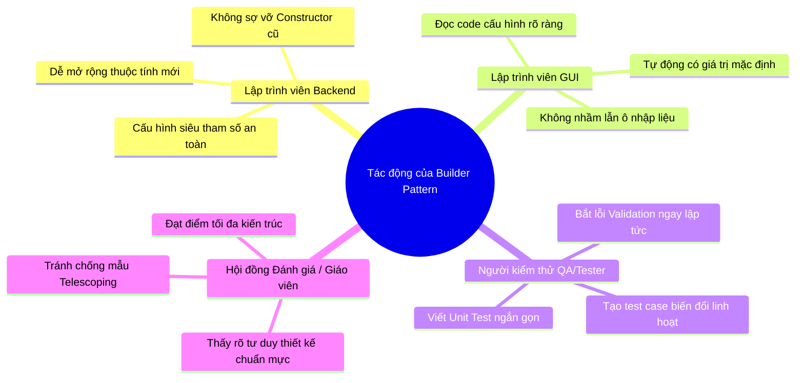

# BÁO CÁO CHUYÊN SÂU VỀ BUILDER PATTERN TRONG DỰ ÁN HUDD-TDS

---

## 📌 1. TỔNG QUAN & KHÁI NIỆM BUILDER PATTERN

### 📘 Khái niệm
**Builder Pattern** (Mẫu Thiết Kế Khởi Tạo) là một mẫu thiết kế thuộc nhóm **Khởi Tạo (Creational Pattern)**.

Nó cung cấp giải pháp xây dựng các đối tượng phức tạp có nhiều thuộc tính theo từng bước bằng cách tách rời quá trình cấu hình khỏi việc tạo đối tượng. Trong dự án, fluent API có dạng `.withMinutil(...).withAlphaConfidence(...).build()`.

Mẫu thiết kế này giảm sự phụ thuộc vào constructor có nhiều tham số vị trí; các constructor hiện hữu vẫn được giữ để tương thích.

---

## 🏗️ 2. SƠ ĐỒ KIẾN TRÚC LỚP (CLASS ARCHITECTURE)

### 📐 Sơ đồ Lớp (Class Diagram)

```mermaid
classDiagram
    class HUDD_TDS {
        -double minutil
        -int interval
        -int windowSize
        -double alphaConfidence
        -List~Transaction~ memory
        -List~Checkpoint~ checkpoints
        -HUIItemsetMiner huiMiner
        -GlobalDriftStrategy globalDriftDetector
        -LocalDriftStrategy localDriftDetector
        +HUDD_TDS(Builder)
        +getCheckpoints() List~Checkpoint~
        +getAlphaConfidence() double
        +getInterval() int
        +getWindowSize() int
        +getMinutil() double
        +getHuiMiner() HUIItemsetMiner
    }

    class HUDD_TDS_Builder {
        -Map~String, Double~ externalUtilities
        -double minutil
        -int interval
        -int windowSize
        -double alphaConfidence
        -int maxItemsetSize
        -HUIItemsetMiner huiMiner
        -GlobalDriftStrategy globalDriftDetector
        -LocalDriftStrategy localDriftDetector
        +withExternalUtilities(Map) Builder
        +withMinutil(double) Builder
        +withInterval(int) Builder
        +withWindowSize(int) Builder
        +withAlphaConfidence(double) Builder
        +withMaxItemsetSize(int) Builder
        +withMiner(HUIItemsetMiner) Builder
        +withGlobalStrategy(GlobalDriftStrategy) Builder
        +withLocalStrategy(LocalDriftStrategy) Builder
        +build() HUDD_TDS
    }

    class SimulationConfiguration {
        -String datasetName
        -File customInvestmentFile
        -double minutil
        -int interval
        -int windowSize
        -double alphaConfidence
        -int maxItemsetSize
        -HUIItemsetMiner huiItemsetMiner
        -GlobalDriftStrategy globalDriftStrategy
        -LocalDriftStrategy localDriftStrategy
        -SimulationConfiguration(Builder)
        +builder(String) Builder
        +getDatasetName() String
        +getCustomInvestmentFile() File
        +getMinutil() double
        +getInterval() int
        +getWindowSize() int
        +getAlphaConfidence() double
        +getMaxItemsetSize() int
        +getHuiItemsetMiner() HUIItemsetMiner
        +getGlobalDriftStrategy() GlobalDriftStrategy
        +getLocalDriftStrategy() LocalDriftStrategy
    }

    class SimulationConfiguration_Builder {
        -String datasetName
        -File customInvestmentFile
        -double minutil
        -int interval
        -int windowSize
        -double alphaConfidence
        -int maxItemsetSize
        -HUIItemsetMiner huiItemsetMiner
        -GlobalDriftStrategy globalDriftStrategy
        -LocalDriftStrategy localDriftStrategy
        +withCustomInvestmentFile(File) Builder
        +withMinutil(double) Builder
        +withInterval(int) Builder
        +withWindowSize(int) Builder
        +withAlphaConfidence(double) Builder
        +withMaxItemsetSize(int) Builder
        +withHuiItemsetMiner(HUIItemsetMiner) Builder
        +withGlobalDriftStrategy(GlobalDriftStrategy) Builder
        +withLocalDriftStrategy(LocalDriftStrategy) Builder
        +build() SimulationConfiguration
    }

    class SimulationEvent {
        -EventType type
        -int tid
        -Transaction transaction
        -Checkpoint checkpoint
        -DriftResult driftResult
        -DriftResult globalDrift
        -DriftResult localDrift
        -List~String~ itemsetVectors
        -int totalEstimate
        -int speedTxPerSec
        -String message
        -String globalDriftMessage
        -String localDriftMessage
        +SimulationEvent(Builder)
        +getType() EventType
        +getTid() int
        +getTransaction() Transaction
        +getCheckpoint() Checkpoint
        +getDriftResult() DriftResult
        +getGlobalDrift() DriftResult
        +getLocalDrift() DriftResult
        +getItemsetVectors() List~String~
        +getTotalEstimate() int
        +getSpeedTxPerSec() int
        +getMessage() String
        +getGlobalDriftMessage() String
        +getLocalDriftMessage() String
    }

    class SimulationEvent_Builder {
        -EventType type
        -int tid
        -Transaction transaction
        -Checkpoint checkpoint
        -DriftResult driftResult
        -DriftResult globalDrift
        -DriftResult localDrift
        -List~String~ itemsetVectors
        -int totalEstimate
        -int speedTxPerSec
        -String message
        -String globalDriftMessage
        -String localDriftMessage
        +withType(EventType) Builder
        +withTid(int) Builder
        +withTransaction(Transaction) Builder
        +withCheckpoint(Checkpoint) Builder
        +withDriftResult(DriftResult) Builder
        +withGlobalDrift(DriftResult) Builder
        +withLocalDrift(DriftResult) Builder
        +withItemsetVectors(List~String~) Builder
        +withTotalEstimate(int) Builder
        +withSpeedTxPerSec(int) Builder
        +withMessage(String) Builder
        +withGlobalDriftMessage(String) Builder
        +withLocalDriftMessage(String) Builder
        +build() SimulationEvent
    }

    SimulationConfiguration +-- SimulationConfiguration_Builder : creates
    HUDD_TDS +-- HUDD_TDS_Builder : Inner Static Class
    SimulationEvent +-- SimulationEvent_Builder : Inner Static Class
```

### 🔄 Sơ đồ Quy trình Khởi tạo So sánh

```mermaid
flowchart TD
    subgraph KHI KHÔNG DÙNG BUILDER (Dễ sai sót)
        C1[Client/Caller] -->|Truyền hàng dài 13 tham số| Cons[Constructor 13 tham số]
        Cons -->|Nguy cơ truyền lầm vị trí double/int| Error[Lỗi ngầm Silent Bug khó phát hiện]
    end

    subgraph KHI ÁP DỤNG BUILDER PATTERN (Rõ nghĩa hơn)
        C2[Client/Caller] -->|Gán từng thuộc tính rõ tên| Step1[Builder.withMinutil 15.0]
        Step1 --> Step2[Builder.withAlphaConfidence 0.05]
        Step2 --> Step3[Builder.withWindowSize 200]
        Step3 -->|Setter kiểm tra tham số| Validate{Giá trị hợp lệ?}
        Validate -->|Hợp lệ| Next[Tiếp tục cấu hình]
        Validate -->|Không hợp lệ| Exception[Ném IllegalArgumentException tại setter]
        Next --> Build[build -> Tạo HUDD_TDS]
    end
```

---

## 🎯 3. LÝ DO CHỌN BUILDER PATTERN

Chúng tôi lựa chọn **Builder Pattern** cho hệ thống vì các lý do chiến lược sau:

1. **Loại bỏ nguy cơ Lỗi Tàng hình (Silent Bug)**:
   Trong Java, truyền nhầm hai tham số cùng kiểu vào constructor có thể không bị trình biên dịch phát hiện. Builder làm lời gọi rõ nghĩa hơn bằng `.withMinutil()` và `.withAlphaConfidence()`; nó giảm rủi ro đọc nhầm nhưng không loại bỏ mọi lỗi cấu hình.
2. **Mã nguồn Tự tư liệu hóa (Self-documenting Code)**:
   Thay vì dòng code khó hiểu `new SimulationEvent(TYPE, 10, tx, cp, d1, d2, d3, list, 1000, 50, null, msg1, msg2)`, việc dùng Builder `.withTid(10).withCheckpoint(cp).withSpeedTxPerSec(50)` giúp bất kỳ ai đọc code cũng hiểu ngay ý nghĩa từng thuộc tính.
3. **Tích hợp Bước Kiểm tra Hợp lệ (Validation Step)**:
   `HUDD_TDS.Builder` kiểm tra `minutil` hữu hạn/không âm, `interval` và
   `windowSize` dương, alpha trong `(0,1)`, cùng giới hạn itemset không âm.
   `SimulationConfiguration.Builder` áp dụng các điều kiện tương ứng và yêu cầu
   tên dataset không rỗng. Constructor engine tương thích cũ không chạy các kiểm
   tra của Builder.
4. **Giá trị mặc định cho cấu hình Engine**:
   Builder của `HUDD_TDS` có các giá trị mặc định cho external utilities, `minutil`, `interval`, `windowSize`, alpha và giới hạn itemset. Các trường tùy chọn của `SimulationEvent.Builder` có thể vẫn là `null` hoặc giá trị mặc định Java nếu caller không thiết lập.

---

## 🧩 4. TẠI SAO BUILDER PATTERN LẠI PHÙ HỢP ĐẶC BIỆT VỚI DỰ ÁN HUDD-TDS?

Dự án **HUDD-TDS** (*High-Utility Itemset Discovery with Temporal Drift Detection on Data Streams*) là một hệ thống xử lý luồng dữ liệu stream với các đặc thù kỹ thuật rất riêng:

- **Có vô số Siêu tham số (Hyper-parameters) toán học**:
  Bộ điều phối `HUDD_TDS` đòi hỏi cấu hình đồng thời rất nhiều tham số:
  - `minutil` (double): Ngưỡng độ lợi tối thiểu.
  - `interval` (int): Chu kỳ đánh giá checkpoint.
  - `windowSize` (int): Kích thước cửa sổ trượt.
  - `alphaConfidence` (double): Ngưỡng tin cậy trôi dạt.
  - `maxItemsetSize` (int): Độ dài tập mục tối đa.
  - `externalUtilities` (Map): Bảng giá trị đầu tư ngoại vi.
  - `huiMiner` (HUIItemsetMiner): Chiến lược khai phá HUI.
  - `globalDriftDetector` (GlobalDriftStrategy): Chiến lược trôi dạt toàn cục.
  - `localDriftDetector` (LocalDriftStrategy): Chiến lược trôi dạt cục bộ.

- **Đối tượng Sự kiện `SimulationEvent` có nhiều trường tùy chọn**:
  Payload có 13 trường gồm loại/TID, transaction, checkpoint, kết quả drift, vector itemset, tiến độ/tốc độ và thông điệp. Payload không chứa số đo RAM.

Builder giúp việc cấu hình Engine và tạo event dễ đọc hơn; nó không tự bảo đảm
tính đúng đắn của công thức hoặc deep-copy các đối tượng model được tham chiếu.

---

## 🛠️ 5. KHI ÁP DỤNG BUILDER PATTERN, NÓ GIẢI QUYẾT ĐƯỢC NHỮNG VẤN ĐỀ GÌ?

| Vấn đề cần xử lý | Cách Builder hỗ trợ |
| :--- | :--- |
| **Constructor có nhiều tham số vị trí** | Builder cho phép ghi cấu hình theo tên phương thức; các constructor hiện hữu vẫn được giữ để tương thích. |
| **Khó đọc lời gọi tham số cùng kiểu** | `.withMinutil(15.0)` và `.withAlphaConfidence(0.05)` làm rõ ý nghĩa từng giá trị, nhưng không thay thế kiểm tra nghiệp vụ. |
| **Mở rộng cấu hình** | Có thể thêm phương thức cấu hình vào Builder; mức độ tương thích vẫn phụ thuộc các API và caller hiện có. |
| **Cấu hình số học không hợp lệ**<br>Nhập `minutil` âm/không hữu hạn, interval/window không dương, alpha ngoài `(0,1)` hoặc giới hạn itemset âm. | `SimulationConfiguration.Builder` và `HUDD_TDS.Builder` từ chối tham số tương ứng. `HUDD_TDS.Builder` cũng snapshot map external utility. `SimulationEvent.Builder` kiểm tra các payload cốt yếu theo loại event. |

---

## 📁 6. CHI TIẾT CÁC FILE THAY ĐỔI & VÍ DỤ MÃ NGUỒN (BEFORE vs AFTER)

Khi áp dụng **Builder Pattern**, các tệp trong dự án thay đổi cụ thể như sau:

### 1. Tệp thuật toán lõi: [HUDD_TDS.java](../src/huddtds/algorithm/HUDD_TDS.java)
- **Hiện trạng**: Có `static class Builder` bên trong `HUDD_TDS`. Các setter kiểm tra miền số học và `externalUtilities` được sao chép thành map không sửa được; `build()` tạo engine.
- ❌ **TRƯỚC**:
  ```java
  // Khởi tạo rối rắm, rất dễ nhầm lẫn vị trí giữa các số double và int:
  HUDD_TDS engine = new HUDD_TDS(externalUtilities, 15.0, 100, 200, 0.05, miner, globalDetector, localDetector);
  ```
- ✅ **SAU**:
  ```java
  // Tên phương thức giúp đọc rõ ý nghĩa tham số:
  HUDD_TDS engine = new HUDD_TDS.Builder()
      .withExternalUtilities(externalUtilities)
      .withMinutil(15.0)
      .withInterval(100)
      .withWindowSize(200)
      .withAlphaConfidence(0.05)
      .withMiner(miner)
      .withGlobalStrategy(globalDetector)
      .withLocalStrategy(localDetector)
      .build();
  ```

---

### 2. Tệp sự kiện ứng dụng: [SimulationEvent.java](../src/huddtds/application/event/SimulationEvent.java)
- **Hiện trạng**: Có `static class Builder`; danh sách `itemsetVectors` được sao chép và bọc thành danh sách không sửa được.
- **Constructor vị trí 13 tham số vẫn còn để tương thích**:
  ```java
  SimulationEvent event = new SimulationEvent(
      EventType.CHECKPOINT_CREATED, tid, transaction, checkpoint, 
      null, globalDrift, localDrift, vectors, 1000, 50, null, msg1, msg2
  );
  ```
- ✅ **Builder API hiện tại**:
  ```java
  SimulationEvent event = new SimulationEvent.Builder()
      .withType(EventType.CHECKPOINT_CREATED)
      .withTid(tid)
      .withTransaction(transaction)
      .withCheckpoint(checkpoint)
      .withGlobalDrift(globalDrift)
      .withLocalDrift(localDrift)
      .withItemsetVectors(vectors)
      .withTotalEstimate(1000)
      .withSpeedTxPerSec(50)
      .build();
  ```

---

### 3. Tệp dịch vụ mặt tiền: [SimulationFacade.java](../src/huddtds/application/facade/SimulationFacade.java)
- **Hiện trạng**: Dùng `HUDD_TDS.Builder` để khởi tạo engine trong `createSimulationService`.

---

### 4. Tệp dịch vụ mô phỏng: [SimulationService.java](../src/huddtds/application/SimulationService.java)
- **Hiện trạng**: Tạo các `SimulationEvent` bằng Builder khi phát checkpoint, drift, tiến độ, hoàn tất hoặc lỗi. GUI không trực tiếp dựng event này.

---

### 5. Tệp kiểm thử: [BuilderPatternTest.java](../test/BuilderPatternTest.java)
- **Phạm vi**: Kiểm tra cấu hình Engine và event qua Builder, một số trường hợp tham số biên và fluent API.

Builder từ chối `alphaConfidence` ngoài `(0,1)`, đồng nhất với miền của các
công thức trong `UtilityMetrics`. `SimulationEvent.Builder` yêu cầu event type,
TID không âm, checkpoint cho `CHECKPOINT_CREATED`, `DriftResult` đã phát hiện
và đúng loại cho event global/local, cùng metadata tiến độ không âm. Constructor
công khai kiểu cũ của `SimulationEvent` vẫn giữ để tương thích nhưng không áp
dụng các kiểm tra này; danh sách vector chỉ được copy nông.

---

## 👥 7. KHI ÁP DỤNG BUILDER PATTERN SẼ ẢNH HƯỞNG TỚI NHỮNG AI?

Áp dụng Builder Pattern mang lại ảnh hưởng tích cực rõ rệt cho **4 nhóm đối tượng**:



### 1️⃣ Đối với Lập trình viên Backend / Thuật toán (Core Developers)
- **Tác động**: Khi bổ sung một tham số toán học mới vào bộ điều phối `HUDD_TDS`, không còn phải đi sửa lại hàng loạt Constructor cũ ở khắp nơi trong dự án.
- **Lợi ích**: Chỉ cần thêm 1 thuộc tính và 1 phương thức `.withNewProperty()` vào Builder. Việc bảo trì và mở rộng thuật toán trở nên nhẹ nhàng, an toàn.

### 2️⃣ Đối với Lập trình viên Giao diện (UI Developers)
- **Tác động**: Không cần phải mò mẫm đếm vị trí tham số thứ 4 hay thứ 6 trong Constructor khi lấy dữ liệu từ các ô nhập liệu Swing (`txtMinUtil`, `txtAlpha`).
- **Lợi ích**: Gõ mã khởi tạo dạng `.withMinutil(...)` giúp code rõ nghĩa, không bao giờ lo truyền nhầm giá trị của ô MinUtil sang ô Alpha.

### 3️⃣ Đối với Người kiểm thử (QA / Automation Testers)
- **Tác động**: Dễ dàng tạo ra hàng loạt đối tượng cấu hình thử nghiệm với các biến thể tham số khác nhau (ví dụ: test case 1 chỉ đổi `minutil`, test case 2 chỉ đổi `windowSize`).
- **Lợi ích**: Tối ưu hóa việc viết các bài Unit Test tự động, kiểm tra các biên giá trị (Boundary Values) an toàn.

### 4️⃣ Đối với Giáo viên / Hội đồng bảo vệ đồ án (Reviewer / Evaluator)
- **Tác động**: Thấy được mã nguồn của dự án được đầu tư bài bản, chuẩn mực.
- **Lợi ích**: Đánh giá cao tư duy thiết kế phần mềm của lập trình viên khi biết áp dụng Builder Pattern để phòng tránh các chống mẫu (Anti-Patterns) phổ biến trong lập trình hướng đối tượng.
