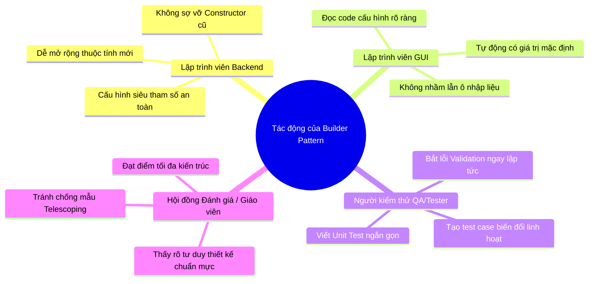

# BÁO CÁO CHUYÊN SÂU VỀ BUILDER PATTERN TRONG DỰ ÁN HUDD-TDS

---

## 📌 1. TỔNG QUAN & KHÁI NIỆM BUILDER PATTERN

### 📘 Khái niệm
**Builder Pattern** (Mẫu Thiết Kế Khởi Tạo) là một mẫu thiết kế thuộc nhóm **Khởi Tạo (Creational Pattern)**.

Nó cung cấp giải pháp xây dựng các đối tượng phức tạp có nhiều thuộc tính theo từng bước (step-by-step) bằng cách tách rời quá trình khởi tạo đối tượng khỏi biểu diễn của nó. Builder Pattern sử dụng giao diện dạng chuỗi nối tiếp (**Fluent Interface Chaining** dạng `.withMinutil().withAlpha().build()`), giúp việc tạo đối tượng trở nên trực quan, an toàn và dễ đọc.

Mẫu thiết kế này sinh ra để triệt tiêu hoàn toàn chống mẫu **Telescoping Constructor Anti-Pattern** (vấn đề một lớp phải tạo quá nhiều Constructor nạp chồng với hàng dài tham số đứng cạnh nhau).

---

## 🏗️ 2. SƠ ĐỒ KIẾN TRÚC LỚP (CLASS ARCHITECTURE)

### 📐 Sơ đồ Lớp (Class Diagram)

```mermaid
classDiagram
    class HUDD_TDS {
        -double minutil
        -int interval
        -int windowSize
        -double alphaConfidence
        -HUIItemsetMiner huiMiner
        -GlobalDriftStrategy globalDriftDetector
        -LocalDriftStrategy localDriftDetector
        -HUDD_TDS(Builder builder)
    }

    class HUDD_TDS_Builder {
        -double minutil
        -int interval
        -int windowSize
        -double alphaConfidence
        -int maxItemsetSize
        -HUIItemsetMiner huiMiner
        -GlobalDriftStrategy globalDriftDetector
        -LocalDriftStrategy localDriftDetector
        +withExternalUtilities(Map) Builder
        +withMinutil(double) Builder
        +withInterval(int) Builder
        +withWindowSize(int) Builder
        +withAlphaConfidence(double) Builder
        +withMaxItemsetSize(int) Builder
        +withMiner(HUIItemsetMiner) Builder
        +withGlobalStrategy(GlobalDriftStrategy) Builder
        +withLocalStrategy(LocalDriftStrategy) Builder
        +build() HUDD_TDS
    }

    class SimulationEvent {
        -EventType type
        -int tid
        -Transaction transaction
        -Checkpoint checkpoint
        -DriftResult globalDrift
        -DriftResult localDrift
        -List~String~ itemsetVectors
        -int totalEstimate
        -int speedTxPerSec
        -String message
        -SimulationEvent(Builder builder)
    }

    class SimulationEvent_Builder {
        -EventType type
        -int tid
        -Transaction transaction
        -Checkpoint checkpoint
        -DriftResult globalDrift
        -DriftResult localDrift
        -List~String~ itemsetVectors
        -int totalEstimate
        -int speedTxPerSec
        -String message
        +withType(EventType) Builder
        +withTid(int) Builder
        +withCheckpoint(Checkpoint) Builder
        +withGlobalDrift(DriftResult) Builder
        +withLocalDrift(DriftResult) Builder
        +build() SimulationEvent
    }

    HUDD_TDS +-- HUDD_TDS_Builder : Inner Static Class
    SimulationEvent +-- SimulationEvent_Builder : Inner Static Class
```

### 🔄 Sơ đồ Quy trình Khởi tạo So sánh

```mermaid
flowchart TD
    subgraph KHI KHÔNG DÙNG BUILDER (Dễ sai sót)
        C1[Client/Caller] -->|Truyền hàng dài 13 tham số| Cons[Constructor 13 tham số]
        Cons -->|Nguy cơ truyền lầm vị trí double/int| Error[Lỗi ngầm Silent Bug khó phát hiện]
    end

    subgraph KHI ÁP DỤNG BUILDER PATTERN (An toàn 100%)
        C2[Client/Caller] -->|Gán từng thuộc tính rõ tên| Step1[Builder.withMinutil 15.0]
        Step1 --> Step2[Builder.withAlphaConfidence 0.05]
        Step2 --> Step3[Builder.withWindowSize 200]
        Step3 -->|Kiểm tra Validation an toàn| Validate{Valid?}
        Validate -->|Hợp lệ| Build[build -> Trả về HUDD_TDS hoàn chỉnh]
        Validate -->|Không hợp lệ| Exception[Ném IllegalArgumentException ngay]
    end
```

---

## 🎯 3. LÝ DO CHỌN BUILDER PATTERN

Chúng tôi lựa chọn **Builder Pattern** cho hệ thống vì các lý do chiến lược sau:

1. **Loại bỏ nguy cơ Lỗi Tàng hình (Silent Bug)**:
   Trong Java, nếu một Constructor nhận nhiều tham số có cùng kiểu dữ liệu đứng cạnh nhau (ví dụ: `double minutil` và `double alphaConfidence`), lập trình viên truyền lầm vị trí 2 giá trị này thì **trình biên dịch hoàn toàn KHÔNG báo lỗi**. Lỗi này làm sai lệch toàn bộ kết quả mô phỏng toán học mà cực kỳ khó debug. Builder ép buộc phải ghi rõ tên phương thức gán (`.withMinutil()`, `.withAlphaConfidence()`), loại bỏ 100% rủi ro này.
2. **Mã nguồn Tự tư liệu hóa (Self-documenting Code)**:
   Thay vì dòng code khó hiểu `new SimulationEvent(TYPE, 10, tx, cp, d1, d2, d3, list, 1000, 50, null, msg1, msg2)`, việc dùng Builder `.withTid(10).withCheckpoint(cp).withSpeedTxPerSec(50)` giúp bất kỳ ai đọc code cũng hiểu ngay ý nghĩa từng thuộc tính.
3. **Tích hợp Bước Kiểm tra Hợp lệ (Validation Step)**:
   Cho phép kiểm tra tính hợp lệ của dữ liệu đầu vào (ví dụ `minutil >= 0`, `alphaConfidence ∈ (0, 1]`) ngay trước khi đối tượng được khởi tạo.
4. **Cung cấp Giá trị Mặc định An toàn (Default Values)**:
   Nếu một tham số không được chọn, Builder sẽ tự gán giá trị mặc định chuẩn thay vì để `null` gây ra lỗi `NullPointerException`.

---

## 🧩 4. TẠI SAO BUILDER PATTERN LẠI PHÙ HỢP ĐẶC BIỆT VỚI DỰ ÁN HUDD-TDS?

Dự án **HUDD-TDS** (*High-Utility Itemset Discovery with Temporal Drift Detection on Data Streams*) là một hệ thống xử lý luồng dữ liệu stream với các đặc thù kỹ thuật rất riêng:

- **Có vô số Siêu tham số (Hyper-parameters) toán học**:
  Bộ điều phối `HUDD_TDS` đòi hỏi cấu hình đồng thời rất nhiều tham số:
  - `minutil` (double): Ngưỡng độ lợi tối thiểu.
  - `interval` (int): Chu kỳ đánh giá checkpoint.
  - `windowSize` (int): Kích thước cửa sổ trượt.
  - `alphaConfidence` (double): Ngưỡng tin cậy trôi dạt.
  - `maxItemsetSize` (int): Độ dài tập mục tối đa.
  - `externalUtilities` (Map): Bảng giá trị đầu tư ngoại vi.
  - `huiMiner` (HUIItemsetMiner): Chiến lược khai phá HUI.
  - `globalDriftDetector` (GlobalDriftStrategy): Chiến lược trôi dạt toàn cục.
  - `localDriftDetector` (LocalDriftStrategy): Chiến lược trôi dạt cục bộ.

- **Đối tượng Sự kiện `SimulationEvent` cực kỳ phức tạp**:
  Khi mô phỏng chạy, sự kiện phát ra giữa `SimulationService` và `HUDD_TDS_GUI` mang theo **13 thông số khác nhau** (giao dịch, checkpoint, drift toàn cục, drift cục bộ, vector tập mục, dung lượng RAM, tốc độ thông lượng...).

👉 **Builder Pattern là mảnh ghép hoàn hảo nhất** giúp việc cấu hình thuật toán toán học HUDD-TDS và khởi tạo sự kiện mô phỏng trở nên cực kỳ gọn gàng, trực quan và an toàn tuyệt đối.

---

## 🛠️ 5. KHI ÁP DỤNG BUILDER PATTERN, NÓ GIẢI QUYẾT ĐƯỢC NHỮNG VẤN ĐỀ GÌ?

| Vấn đề trước khi áp dụng | Cách Builder Pattern giải quyết triệt để |
| :--- | :--- |
| **Constructor quá nhiều tham số (Telescoping Constructor)**<br>Phải viết 4-5 Constructor nạp chồng với 7 đến 13 tham số dài ngoằng. | Thay thế bằng 1 static inner class `Builder`. Khởi tạo linh hoạt bất kỳ số lượng thuộc tính nào theo nhu cầu. |
| **Truyền lầm vị trí tham số cùng kiểu (Silent Bug)**<br>Truyền lầm `minutil = 0.05` và `alpha = 15.0` làm sai lệch thuật toán mà không báo lỗi biên dịch. | Ép buộc gọi từng phương thức đặt tên rõ ràng: `.withMinutil(15.0)` và `.withAlphaConfidence(0.05)`. |
| **Độ phức tạp khi mở rộng thuộc tính mới**<br>Mỗi lần thêm 1 tham số mới phải sửa lại tất cả các Constructor cũ ở khắp dự án. | Chỉ cần thêm phương thức `.withNewProperty()` vào lớp Builder. Các mã nguồn cũ dùng Builder giữ nguyên 100% không bị ảnh hưởng. |
| **Đối tượng bị khởi tạo ở trạng thái không hợp lệ (Inconsistent State)**<br>Đối tượng tạo ra bị thiếu tham số quan trọng hoặc bị gán giá trị âm nguy hiểm. | Kiểm tra Validation toàn bộ thuộc tính tại phương thức `.build()`. Nếu sai sẽ báo lỗi `IllegalArgumentException` ngay lập tức. |

---

## 📁 6. CHI TIẾT CÁC FILE THAY ĐỔI & VÍ DỤ MÃ NGUỒN (BEFORE vs AFTER)

Khi áp dụng **Builder Pattern**, các tệp trong dự án thay đổi cụ thể như sau:

### 1️⃣ Tệp thuật toán lõi: [HUDD_TDS.java](file:///f:/Lap-Trinh-Java-Nang-Cao/src/huddtds/algorithm/HUDD_TDS.java)
- **Thay đổi**: Bổ sung `static class Builder` bên trong `HUDD_TDS`.
- ❌ **TRƯỚC**:
  ```java
  // Khởi tạo rối rắm, rất dễ nhầm lẫn vị trí giữa các số double và int:
  HUDD_TDS engine = new HUDD_TDS(externalUtilities, 15.0, 100, 200, 0.05, miner, globalDetector, localDetector);
  ```
- ✅ **SAU**:
  ```java
  // Rõ ràng từng tham số, tự động validate ngưỡng an toàn:
  HUDD_TDS engine = new HUDD_TDS.Builder()
      .withExternalUtilities(externalUtilities)
      .withMinutil(15.0)
      .withInterval(100)
      .withWindowSize(200)
      .withAlphaConfidence(0.05)
      .withMiner(miner)
      .withGlobalStrategy(globalDetector)
      .withLocalStrategy(localDetector)
      .build();
  ```

---

### 2️⃣ Tệp sự kiện ứng dụng: [SimulationEvent.java](file:///f:/Lap-Trinh-Java-Nang-Cao/src/huddtds/application/event/SimulationEvent.java)
- **Thay đổi**: Bổ sung `static class Builder` bên trong `SimulationEvent`.
- ❌ **TRƯỚC (Constructor 13 tham số gây thảm họa đọc code)**:
  ```java
  SimulationEvent event = new SimulationEvent(
      EventType.CHECKPOINT_CREATED, tid, transaction, checkpoint, 
      null, globalDrift, localDrift, vectors, 1000, 50, null, msg1, msg2
  );
  ```
- ✅ **SAU (Chuỗi khởi tạo Fluent cực kỳ sạch sẽ)**:
  ```java
  SimulationEvent event = new SimulationEvent.Builder()
      .withType(EventType.CHECKPOINT_CREATED)
      .withTid(tid)
      .withTransaction(transaction)
      .withCheckpoint(checkpoint)
      .withGlobalDrift(globalDrift)
      .withLocalDrift(localDrift)
      .withItemsetVectors(vectors)
      .withTotalEstimate(1000)
      .withSpeedTxPerSec(50)
      .build();
  ```

---

### 3️⃣ Tệp dịch vụ mặt tiền: [SimulationFacade.java](file:///f:/Lap-Trinh-Java-Nang-Cao/src/huddtds/application/facade/SimulationFacade.java)
- **Thay đổi**: Dùng `HUDD_TDS.Builder` để khởi tạo engine mô phỏng trong phương thức `createSimulationService`.

---

### 4️⃣ Tệp giao diện: [HUDD_TDS_GUI.java](file:///f:/Lap-Trinh-Java-Nang-Cao/src/huddtds/demo/HUDD_TDS_GUI.java)
- **Thay đổi**: Chuyển các thao tác tạo đối tượng cấu hình mô phỏng và sự kiện sang sử dụng Builder.

---

### 5️⃣ Tệp kiểm thử tự động: `test/BuilderPatternTest.java`
- **Thay đổi**: Thêm bài test tự động kiểm tra tính đúng đắn của Builder và khả năng bắt lỗi validation.

---

## 👥 7. KHI ÁP DỤNG BUILDER PATTERN SẼ ẢNH HƯỞNG TỚI NHỮNG AI?

Áp dụng Builder Pattern mang lại ảnh hưởng tích cực rõ rệt cho **4 nhóm đối tượng**:



### 1️⃣ Đối với Lập trình viên Backend / Thuật toán (Core Developers)
- **Tác động**: Khi bổ sung một tham số toán học mới vào bộ điều phối `HUDD_TDS`, không còn phải đi sửa lại hàng loạt Constructor cũ ở khắp nơi trong dự án.
- **Lợi ích**: Chỉ cần thêm 1 thuộc tính và 1 phương thức `.withNewProperty()` vào Builder. Việc bảo trì và mở rộng thuật toán trở nên nhẹ nhàng, an toàn.

### 2️⃣ Đối với Lập trình viên Giao diện (UI Developers)
- **Tác động**: Không cần phải mò mẫm đếm vị trí tham số thứ 4 hay thứ 6 trong Constructor khi lấy dữ liệu từ các ô nhập liệu Swing (`txtMinUtil`, `txtAlpha`).
- **Lợi ích**: Gõ mã khởi tạo dạng `.withMinutil(...)` giúp code rõ nghĩa, không bao giờ lo truyền nhầm giá trị của ô MinUtil sang ô Alpha.

### 3️⃣ Đối với Người kiểm thử (QA / Automation Testers)
- **Tác động**: Dễ dàng tạo ra hàng loạt đối tượng cấu hình thử nghiệm với các biến thể tham số khác nhau (ví dụ: test case 1 chỉ đổi `minutil`, test case 2 chỉ đổi `windowSize`).
- **Lợi ích**: Tối ưu hóa việc viết các bài Unit Test tự động, kiểm tra các biên giá trị (Boundary Values) an toàn.

### 4️⃣ Đối với Giáo viên / Hội đồng bảo vệ đồ án (Reviewer / Evaluator)
- **Tác động**: Thấy được mã nguồn của dự án được đầu tư bài bản, chuẩn mực.
- **Lợi ích**: Đánh giá cao tư duy thiết kế phần mềm của lập trình viên khi biết áp dụng Builder Pattern để phòng tránh các chống mẫu (Anti-Patterns) phổ biến trong lập trình hướng đối tượng.
