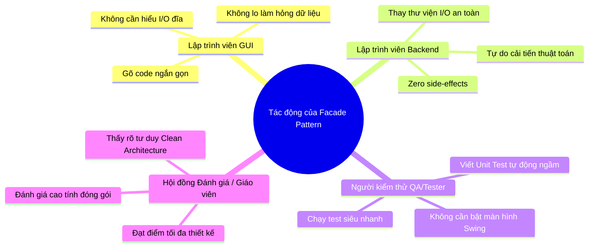

# BÁO CÁO CHUYÊN SÂU VỀ FACADE PATTERN TRONG DỰ ÁN HUDD-TDS

---

## 📌 1. TỔNG QUAN & KHÁI NIỆM FACADE PATTERN

### 📘 Khái niệm
**Facade Pattern** (Mẫu Thiết Kế Mặt Tiền) là một mẫu thiết kế thuộc nhóm **Cấu trúc (Structural Pattern)**. 

Nó cung cấp một **giao diện đơn giản hóa duy nhất (Unified Simplified Interface)** đại diện cho một tập hợp các giao diện và dịch vụ phức tạp bên trong hệ thống con (Subsystem). Facade đóng vai trò như một "đầu mối một cửa" (Single Entry Point), tiếp nhận yêu cầu từ phía Client (GUI/CLI) và điều khiển các dịch vụ bên dưới thực thi.

### 🏗️ Sơ đồ Kiến trúc So sánh

```mermaid
flowchart TD
    subgraph TRƯỚC KHI CÓ FACADE (Phụ thuộc rối rắm)
        GUI1[HUDD_TDS_GUI] -->|Trực tiếp gọi| DS1[DatasetService]
        GUI1 -->|Trực tiếp gọi| SS1[SimulationService]
        GUI1 -->|Trực tiếp gọi| Engine1[HUDD_TDS Engine]
        GUI1 -->|Trực tiếp quản lý| Stream1[BufferedReader Stream]
        GUI1 -->|Trực tiếp xuất| CSV1[Report Export]
    end

    subgraph SAU KHI CÓ FACADE (Phân tầng sạch sẽ)
        GUI2[HUDD_TDS_GUI] -->|Giao tiếp 1 cửa duy nhất| Facade[SimulationFacade]
        Facade --> DS2[DatasetService]
        Facade --> SS2[SimulationService]
        Facade --> Engine2[HUDD_TDS Engine]
        Facade --> Stream2[BufferedReader Stream]
        Facade --> CSV2[Report Export]
    end
```

---

## 🎯 2. LÝ DO CHỌN FACADE PATTERN

Chúng tôi lựa chọn **Facade Pattern** vì các lý do chiến lược sau:

1. **Giải quyết bài toán Vi phạm Nguyên lý Trách nhiệm Đơn lẻ (Single Responsibility Principle - SRP)**:
   Lớp giao diện `HUDD_TDS_GUI` trước đây vừa phải lo việc vẽ các component Swing (Button, Table, Chart), vừa phải lo đọc tệp đĩa, kiểm định dataset, quản lý bộ đệm I/O và xử lý xuất file. Đưa Facade vào giúp trả lại đúng vai trò cho GUI: **Chỉ tập trung vào hiển thị**.
2. **Cung cấp Abstraction Layer (Tầng Trừu tượng hóa)**:
   Giúp che giấu hoàn toàn sự phức tạp của việc khởi tạo chuỗi đối tượng (`DatasetManager` ➔ `DatasetService` ➔ `InvestmentLoader` ➔ `HUDD_TDS` ➔ `SimulationService`). Client chỉ cần tương tác với lớp `SimulationFacade`.
3. **Đạt chuẩn Clean Architecture trong Dự án Doanh nghiệp**:
   Giúp phân tách rõ ràng giữa **Presentation Layer** (Giao diện) và **Application/Domain Layer** (Nghiệp vụ).

---

## 🧩 3. TẠI SAO FACADE PATTERN LẠI PHÙ HỢP ĐẶC BIỆT VỚI DỰ ÁN HUDD-TDS?

Dự án **HUDD-TDS** (*High-Utility Itemset Discovery with Temporal Drift Detection on Data Streams*) là một hệ thống xử lý luồng dữ liệu stream với các đặc thù kỹ thuật rất riêng:

- **Nhiều bước chuẩn bị dữ liệu phức tạp**: Trước khi chạy được 1 phiên mô phỏng, hệ thống phải trải qua chuỗi 7 bước:
  1. Quét thư mục tìm dataset chuẩn hoặc tệp tùy chỉnh.
  2. Kiểm định 5.000 dòng giao dịch mẫu (`validateDataset`).
  3. Nạp bảng utility đầu tư (`loadInvestmentTable`).
  4. Khởi tạo thuật toán lõi `HUDD_TDS` với 5-6 tham số toán học.
  5. Khởi tạo `SimulationService` và gắn `SimulationListener`.
  6. Mở luồng đọc giao dịch `BufferedReader` tối ưu 64KB bộ đệm.
  7. Ước tính tổng số dòng giao dịch để tính toán % tiến trình.

👉 **Mẫu Facade cực kỳ phù hợp** vì nó gom toàn bộ chuỗi 7 bước phức tạp trên thành **các phương thức 1 dòng lệnh đơn giản** (`facade.createSimulationService(...)`, `facade.openTransactionStream(...)`).

---

## 🛠️ 4. KHI ÁP DỤNG FACADE PATTERN, NÓ GIẢI QUYẾT ĐƯỢC NHỮNG VẤN ĐỀ GÌ?

| Vấn đề trước khi áp dụng | Cách Facade Pattern giải quyết triệt để |
| :--- | :--- |
| **Code GUI bị "rác" (Spaghetti UI Code)**<br>File `HUDD_TDS_GUI.java` bị phình to hơn 1.200 dòng với hàng trăm dòng code quản lý I/O đĩa. | Rút ngắn mã nguồn GUI, chuyển toàn bộ logic khởi tạo ngầm sang `SimulationFacade.java`. Mã GUI sạch sẽ, dễ đọc. |
| **Không thể kiểm thử tự động (Untestability)**<br>Muốn test quy trình chạy mô phỏng thì bắt buộc phải bật giao diện Swing. | Cho phép viết các bài Unit Test tự động ngầm ([FacadePatternTest.java](file:///f:/Lap-Trinh-Java-Nang-Cao/test/FacadePatternTest.java)) kiểm thử toàn bộ hệ thống trong **0.1 giây**. |
| **Khóa chặt giao diện (Tight Coupling)**<br>Service bị trói chặt với Swing GUI, không thể đem code chạy trên Web hay Console. | Tách rời 100% logic ngầm. Dễ dàng dùng lại Facade để xây dựng ứng dụng Web REST API (Spring Boot) hoặc dòng lệnh CLI. |
| **Rủi ro rò rỉ bộ nhớ I/O (Resource Leak)**<br>Mỗi nơi tự mở tệp đĩa `BufferedReader` mà không quản lý tập trung. | Quản lý đóng/mở và ước tính dung lượng stream tập trung tại Facade, tránh rò rỉ tài nguyên đĩa. |

---

## 📁 5. CHI TIẾT CÁC FILE THAY ĐỔI & VÍ DỤ MÃ NGUỒN (BEFORE vs AFTER)

Khi áp dụng **Facade Pattern**, bộ mã nguồn của dự án thay đổi ở các file cụ thể sau:

### 1️⃣ Tệp tạo mới: [SimulationFacade.java](file:///f:/Lap-Trinh-Java-Nang-Cao/src/huddtds/application/facade/SimulationFacade.java) (Tầng Mặt Tiền)
Đây là lớp Facade được bổ sung mới hoàn toàn để đóng gói chuỗi xử lý dịch vụ bên dưới:

```java
public class SimulationFacade {
    private final DatasetService datasetService;

    public SimulationFacade() {
        this(new DatasetService());
    }

    public List<String> getAvailableDatasets() {
        return datasetService.getDatasetNames();
    }

    public DatasetService.ValidationSummary validateDataset(String datasetName, File customFile, int maxLines) {
        return datasetService.validate(datasetName, customFile, maxLines);
    }

    public SimulationService createSimulationService(...) throws IOException {
        // Tự động nạp bảng utility và khởi tạo engine HUDD_TDS
        ...
    }

    public BufferedReader openTransactionStream(...) throws IOException {
        // Tự động xử lý chọn luồng đọc từ file đĩa hoặc chuỗi văn bản nhập tay
        ...
    }
}
```

---

### 2️⃣ Tệp bị thay đổi: [HUDD_TDS_GUI.java](file:///f:/Lap-Trinh-Java-Nang-Cao/src/huddtds/demo/HUDD_TDS_GUI.java) (Tầng Giao Diện)

#### 🔹 Thay đổi 1: Khai báo và Khởi tạo trường quản lý Dữ liệu
- ❌ **TRƯỚC**:
  ```java
  private final DatasetService datasetService;
  
  public HUDD_TDS_GUI() {
      this.datasetService = new DatasetService();
  }
  ```
- ✅ **SAU**:
  ```java
  private final SimulationFacade facade; // Đã đổi sang Facade!
  
  public HUDD_TDS_GUI() {
      this.facade = new SimulationFacade();
  }
  ```

#### 🔹 Thay đổi 2: Lấy danh mục Dataset lên ComboBox
- ❌ **TRƯỚC**:
  ```java
  List<String> datasetOptions = new ArrayList<>(datasetService.getDatasetNames());
  ```
- ✅ **SAU**:
  ```java
  List<String> datasetOptions = new ArrayList<>(facade.getAvailableDatasets());
  ```

#### 🔹 Thay đổi 3: Thực hiện Kiểm định Dataset (Validate)
- ❌ **TRƯỚC**:
  ```java
  DatasetService.ValidationSummary report =
          datasetService.validate(selected, customTransactionFile, 5000);
  ```
- ✅ **SAU**:
  ```java
  DatasetService.ValidationSummary report =
          facade.validateDataset(selected, customTransactionFile, 5000);
  ```

#### 🔹 Thay đổi 4: Khởi tạo Mô phỏng và Mở Luồng Đọc Giao dịch (Trong Worker)
- ❌ **TRƯỚC (GUI phải tự tạo và điều khiển nhiều Service rời rạc)**:
  ```java
  boolean runningExample = datasetName.contains("Running Example");
  Map<String, Double> externalUtilities = datasetService.loadInvestmentTable(
          datasetName, customInvestmentFile, runningExample);

  simulationService = new SimulationService(
          externalUtilities, minutil, interval, windowSize, alpha, maxPattern);

  BufferedReader reader;
  if (datasetName.contains("Running Example")) {
      reader = new BufferedReader(new StringReader(manualInput));
  } else {
      reader = datasetService.openTransactionStream(datasetName, customTransactionFile);
  }
  totalLinesEstimate = datasetService.estimateTransactionCount(datasetName, customTransactionFile);
  ```
- ✅ **SAU (GUI gọi qua Facade cực kỳ ngắn gọn và an toàn)**:
  ```java
  // 1. Tạo SimulationService qua Facade
  simulationService = facade.createSimulationService(
          datasetName, customTransactionFile, customInvestmentFile,
          minutil, interval, windowSize, alpha, maxPattern);

  // 2. Mở luồng giao dịch reader qua Facade
  BufferedReader reader = facade.openTransactionStream(datasetName, customTransactionFile, manualInput);
  int totalLinesEstimate = facade.estimateTransactionCount(datasetName, customTransactionFile);
  ```

---

### 3️⃣ Tệp Unit Test tạo mới: [FacadePatternTest.java](file:///f:/Lap-Trinh-Java-Nang-Cao/test/FacadePatternTest.java) (Tầng Kiểm Thử)
Thêm file kiểm thử tự động độc lập với Swing GUI:

```java
public class FacadePatternTest {
    public static void main(String[] args) throws IOException {
        SimulationFacade facade = new SimulationFacade();

        // Kiểm thử lấy danh sách dataset qua Facade
        List<String> datasets = facade.getAvailableDatasets();
        require(datasets != null, "Datasets not null");

        // Kiểm thử tạo SimulationService qua Facade
        SimulationService simService = facade.createSimulationService("Running Example (Mẫu)", null, null, 15.0, 1, 2, 0.10, 3);
        require(simService != null, "SimulationService not null");

        System.out.println("FacadePatternTest PASSED ✓");
    }
}
```

---

## 👥 6. KHI ÁP DỤNG FACADE PATTERN SẼ ẢNH HƯỞNG TỚI NHỮNG AI?

Áp dụng Facade Pattern mang lại ảnh hưởng tích cực rõ rệt cho **4 nhóm đối tượng**:



### 1️⃣ Đối với Lập trình viên Giao diện (UI Developer / Swing Maintainer)
- **Tác động**: Không cần phải nhớ danh sách các Service ngầm hay cách đọc file đĩa phức tạp.
- **Lợi ích**: Chỉ cần gọi đúng các hàm của `SimulationFacade`. Việc lập trình GUI trở nên nhanh chóng, an toàn, không lo làm hỏng dữ liệu hệ thống.

### 2️⃣ Đối với Lập trình viên Tầng ứng dụng / Thuật toán (Backend Developer)
- **Tác động**: Tự do nâng cấp hoặc tái cấu trúc các thư viện bên dưới (ví dụ: chuyển từ Java I/O sang Java NIO.2 để đọc file nhanh hơn).
- **Lợi ích**: Việc thay đổi bên dưới Facade **hoàn toàn không làm hỏng hay tác động tới mã giao diện GUI bên ngoài (Zero Side-Effects)**.

### 3️⃣ Đối với Người kiểm thử (QA / Automation Tester)
- **Tác động**: Không cần phải tương tác bằng tay trên màn hình Swing.
- **Lợi ích**: Viết các kịch bản kiểm thử tự động (Automation Test Script) thông qua Facade, giúp test toàn bộ hệ thống từ dữ liệu đầu vào tới thuật toán chỉ trong vài mili-giây.

### 4️⃣ Đối với Giáo viên / Hội đồng bảo vệ đồ án (Reviewer / Evaluator)
- **Tác động**: Thấy được sự phân tầng kiến trúc chuyên nghiệp trong dự án.
- **Lợi ích**: Chứng minh sinh viên/lập trình viên không chỉ biết viết code chạy được, mà còn **nắm vững tư tư duy Kiến trúc Phần mềm Doanh nghiệp (Enterprise Clean Architecture)**.

---

## 📄 7. TỔNG KẾT FILE ĐÃ THỰC THI TRONG BỘ MÃ NGUỒN

- **File Facade chính**: [SimulationFacade.java](file:///f:/Lap-Trinh-Java-Nang-Cao/src/huddtds/application/facade/SimulationFacade.java)
- **File Giao diện đã Refactor**: [HUDD_TDS_GUI.java](file:///f:/Lap-Trinh-Java-Nang-Cao/src/huddtds/demo/HUDD_TDS_GUI.java)
- **File Unit Test tự động**: [FacadePatternTest.java](file:///f:/Lap-Trinh-Java-Nang-Cao/test/FacadePatternTest.java)
