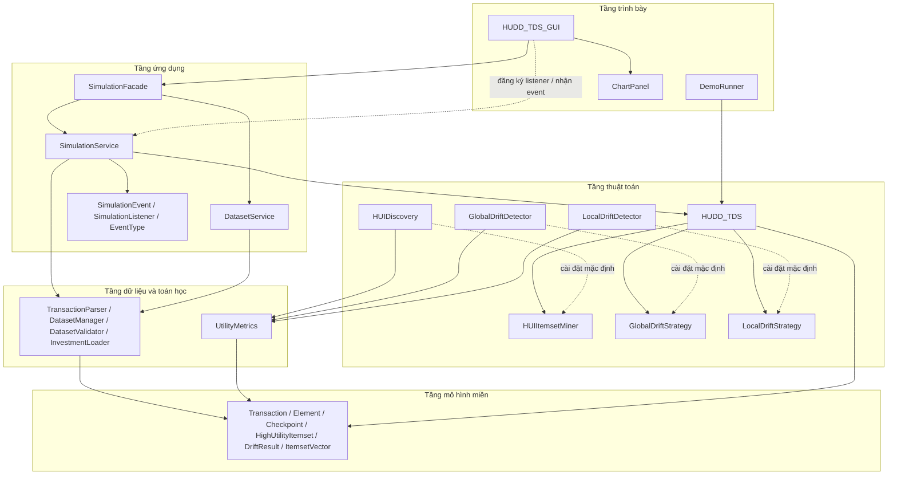

# Kiến trúc hệ thống

## Phạm vi và cấu trúc kiến trúc

Kho mã là một ứng dụng Java được tổ chức thành các gói, không phải tập hợp các
module có thể triển khai độc lập. Chiều phụ thuộc quan sát được trong mã nguồn:

```text
Tầng trình bày
        │
        ▼
SimulationFacade ──> DatasetService / SimulationService
                              │
                              └──> API sự kiện
        │
        ▼
algorithm ───── data ───── math
        \         |         /
         └────────┴────────┘
                   ▼
                 model
```

Mũi tên biểu thị việc sử dụng lớp hoặc interface trong lúc biên dịch.
`DemoRunner` là điểm khởi chạy dòng lệnh và trực tiếp tạo engine thuật toán;
GUI Swing sử dụng các dịch vụ ứng dụng để truy cập tập dữ liệu và chạy mô phỏng.

## Sơ đồ kiến trúc hệ thống

Sơ đồ dưới đây tóm tắt các tầng và quan hệ phụ thuộc chính trong source.
`SimulationFacade` là điểm truy cập mà GUI dùng để phối hợp dịch vụ dataset và
mô phỏng. Các strategy là những điểm được tiêm vào `HUDD_TDS`; `HUIDiscovery`
cùng hai detector là các implementation mặc định. Các gói `data`, `math` và
`algorithm` đều dùng các kiểu thuộc `model`.



## Trách nhiệm của các gói

| Gói | Trách nhiệm chính | Một số kiểu tiêu biểu |
|---|---|---|
| `huddtds.demo` | Giao diện Swing và chương trình minh họa dòng lệnh | `HUDD_TDS_GUI`, `ChartPanel`, `DemoRunner` |
| `huddtds.application` | Dịch vụ ứng dụng cho dataset và mô phỏng | `DatasetService`, `SimulationService` |
| `huddtds.application.facade` | Điểm truy cập đơn giản cho các thao tác ứng dụng mà GUI cần | `SimulationFacade` |
| `huddtds.application.event` | Thông báo mô phỏng có kiểu dữ liệu rõ ràng | `EventType`, `SimulationEvent`, `SimulationListener` |
| `huddtds.algorithm` | Điều phối luồng/checkpoint và các cài đặt thuật toán mặc định | `HUDD_TDS`, `HUIDiscovery`, `GlobalDriftDetector`, `LocalDriftDetector` |
| `huddtds.algorithm.mining` | Hợp đồng chiến lược khai phá HUI | `HUIItemsetMiner` |
| `huddtds.algorithm.drift` | Hợp đồng chiến lược phát hiện drift | `GlobalDriftStrategy`, `LocalDriftStrategy` |
| `huddtds.data` | Phân tích cú pháp, tìm tập dữ liệu, nạp investment và kiểm định | `TransactionParser`, `DatasetManager`, `DatasetValidator`, `InvestmentLoader` |
| `huddtds.math` | Suy giảm utility, thống kê cắt tỉa/phát hiện drift, khoảng cách và vector | `UtilityMetrics` |
| `huddtds.model` | Đối tượng dữ liệu và kết quả dùng chung giữa các tầng | `Transaction`, `Checkpoint`, `HighUtilityItemset`, `DriftResult` |

## Các quan hệ phụ thuộc chính

```text
HUDD_TDS_GUI
  ├── SimulationFacade ──> DatasetService
  ├── SimulationFacade ──> tạo SimulationService
  ├── đăng ký listener với SimulationService / nhận event
  ├── SimulationEvent / SimulationListener
  ├── các kiểu model dùng để hiển thị
  └── ChartPanel

DatasetService ──> DatasetManager / DatasetValidator / InvestmentLoader
SimulationService
  ├──> TransactionParser
  ├──> HUDD_TDS
  ├──> UtilityMetrics
  └──> các kiểu model

HUDD_TDS
  ├──> HUIItemsetMiner       (mặc định: HUIDiscovery)
  ├──> GlobalDriftStrategy   (mặc định: GlobalDriftDetector)
  └──> LocalDriftStrategy    (mặc định: LocalDriftDetector)

algorithm / data / math ──> model
```

GUI dùng `SimulationFacade` để truy cập các thao tác dataset và tạo/mở luồng
mô phỏng. Facade trả về `SimulationService`; service gọi parser và engine bên
trong, rồi phát sự kiện cho GUI listener. Facade không thay thế các service,
không chứa thuật toán và không phải service chạy ở tiến trình riêng hay hệ
thống nạp plugin.

## Các ràng buộc kiến trúc thể hiện trong mã nguồn

- `HUDD_TDS` điều phối việc lưu giao dịch, tạo checkpoint và gọi các strategy.
  Chi tiết khai phá và tính toán drift có thể thay thế qua interface chiến lược.
- `SimulationFacade` gom các thao tác ứng dụng mà GUI cần; nó không làm thay
  nhiệm vụ của `DatasetService` hoặc `SimulationService`.
- GUI sử dụng Facade để truy cập `DatasetService` cho việc tìm và truy cập tệp,
  nhưng tầng dữ liệu vẫn dùng trực tiếp các lớp cài đặt cụ thể; chưa có
  repository interface hay factory tổng quát cho nhiều nguồn dữ liệu.
- API sự kiện không phụ thuộc Swing. `SwingWorker` và GUI chịu trách nhiệm chạy
  nền cũng như cập nhật component.
- Các đối tượng model được dùng chung giữa nhiều tầng. Java module chưa được
  dùng để áp đặt ranh giới giữa các gói.
- Các phương thức drift dạng chuỗi cũ vẫn được giữ để tương thích; application
  service sử dụng các phương thức trả về `DriftResult`.

Chi tiết hành vi xem [algorithm-and-data-flow.md](./algorithm-and-data-flow.md)
và [event-and-gui-flow.md](./event-and-gui-flow.md).
