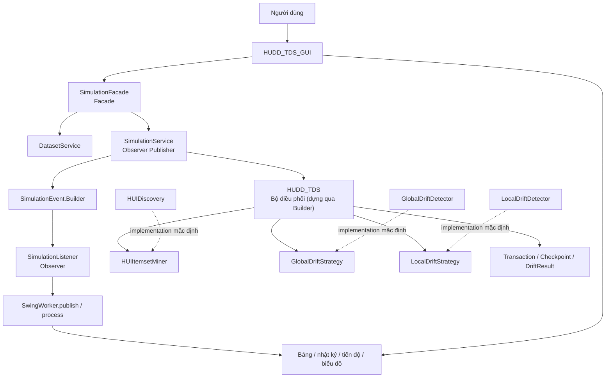
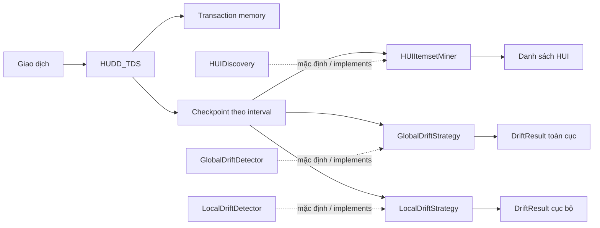
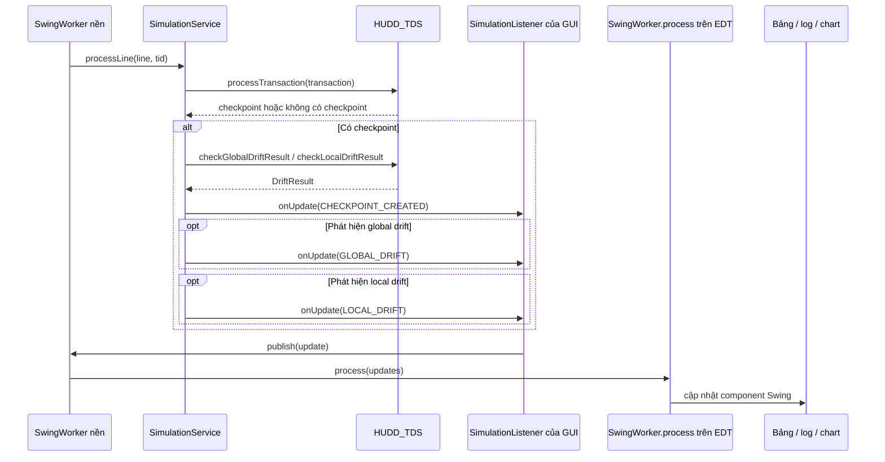
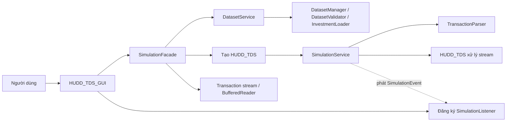

# Nội dung trình bày: bốn mẫu thiết kế trong HUDD-TDS

Tài liệu này là kịch bản trình bày chi tiết về bốn mẫu thiết kế đang có trong
mã nguồn: **Strategy**, **Observer**, **Facade** và **Builder**. Nội dung mô tả implementation
đang dùng, không phải kiến trúc giả định hay thiết kế tương lai.

## Mục tiêu phần trình bày

Sau phần trình bày, người nghe có thể:

1. Nêu được vấn đề thực tế mà mỗi mẫu thiết kế giải quyết.
2. Chỉ ra contract, implementation và nơi sử dụng trong source.
3. Mô tả được đường đi từ giao dịch đầu vào đến kết quả hiển thị.
4. Nêu được bằng chứng kiểm thử và giới hạn đã xác nhận.

## Sơ đồ tổng quan: bốn mẫu phối hợp như thế nào?

### Lời dẫn gợi ý

> Bốn mẫu nằm ở các ranh giới khác nhau. Facade giúp GUI gọi nghiệp vụ ứng dụng
> gọn hơn. Strategy cho engine lựa chọn/thay thế thuật toán HUI và phát hiện
> drift. Observer chuyển kết quả từ service đến subscriber mà không để service
> phụ thuộc Swing. Builder giúp khởi tạo engine và event payload an toàn, linh hoạt.
> Chúng phối hợp trong cùng luồng xử lý nhưng không thay thế nhau.
> trách nhiệm của nhau.

## 1. Strategy — thay đổi thuật toán mà giữ nguyên bộ điều phối

### 1.1 Vấn đề và lý do lựa chọn

HUDD-TDS có các thuật toán con có khả năng thay đổi độc lập:

- cách khai phá tập mục có độ lợi cao;
- cách đánh giá trôi dạt toàn cục;
- cách đánh giá trôi dạt cục bộ.

Trong khi đó, luồng nhận giao dịch, duy trì bộ nhớ và tạo checkpoint là phần
điều phối tương đối ổn định. Nếu các thuật toán được gọi trực tiếp qua lớp cụ
thể, engine sẽ bị gắn chặt với implementation hiện tại. Strategy đặt mỗi điểm
thay đổi sau một interface để engine chỉ gọi contract.

### 1.2 Sơ đồ

### 1.3 Vị trí áp dụng

| Vai trò | Lớp/interface |
|---|---|
| Context/bộ điều phối | [`HUDD_TDS.java`](../src/huddtds/algorithm/HUDD_TDS.java) |
| Strategy khai phá HUI | [`HUIItemsetMiner.java`](../src/huddtds/algorithm/mining/HUIItemsetMiner.java) |
| Strategy drift toàn cục | [`GlobalDriftStrategy.java`](../src/huddtds/algorithm/drift/GlobalDriftStrategy.java) |
| Strategy drift cục bộ | [`LocalDriftStrategy.java`](../src/huddtds/algorithm/drift/LocalDriftStrategy.java) |
| Implementation mặc định khai phá | [`HUIDiscovery.java`](../src/huddtds/algorithm/HUIDiscovery.java) |
| Implementation mặc định global | [`GlobalDriftDetector.java`](../src/huddtds/algorithm/GlobalDriftDetector.java) |
| Implementation mặc định local | [`LocalDriftDetector.java`](../src/huddtds/algorithm/LocalDriftDetector.java) |
| Kiểm thử injection/delegation | [`StrategyInjectionTest.java`](../test/StrategyInjectionTest.java) |

### 1.4 Cách hoạt động trong source

`HUDD_TDS` có các constructor tương thích hiện hữu, tự tạo ba implementation
mặc định. Constructor injection nhận ba interface để caller đưa implementation
được chọn vào engine. Engine giữ các tham chiếu dạng interface, không yêu cầu
caller phải dùng đúng ba lớp mặc định.

Khi xử lý một giao dịch:

1. Engine đưa giao dịch vào bộ nhớ stream.
2. Nếu TID chưa đến bội số của `interval`, engine chưa tạo checkpoint.
3. Tại checkpoint, engine gọi miner thông qua `HUIItemsetMiner.discover(...)`.
4. Engine tính global distance của checkpoint và lưu checkpoint.
5. Sau khi có tối thiểu hai checkpoint, các API drift chuyển cặp checkpoint/
   quan sát đến global và local strategy.
6. Kết quả drift hiện đại là `DriftResult`; các API chuỗi legacy vẫn còn để
   tương thích.

Strategy cho phép thay implementation lúc khởi tạo bằng mã Java. Đây không
phải hệ thống plugin tự nạp implementation khi chương trình đang chạy.

### 1.5 Kết quả và bằng chứng

- `StrategyInjectionTest` dùng miner và detector giả để đếm số lần gọi, kiểm
  tra engine đã ủy quyền đúng cho cả ba contract.
- Test kiểm tra API drift kiểu cũ vẫn trả chuỗi mong đợi và API mới vẫn trả
  `DriftResult` với loại, statistic, threshold và affected itemset.
- Trong lần build/regression gần nhất đã ghi nhận, biên dịch toàn bộ `src` và
  `test` cùng `StrategyInjectionTest` thành công.

### 1.6 Điểm cần trình bày trung thực

Global strategy có trạng thái lịch sử. Không nên gọi API chuỗi legacy và API
`DriftResult` cho cùng một checkpoint trên cùng engine vì cả hai đều gọi
strategy. Hãy chọn một dạng API cho từng luồng xử lý.

### Lời thuyết trình gợi ý

> Strategy phù hợp vì hệ thống có ba variation point thuật toán nhưng chỉ một
> bộ điều phối luồng/checkpoint. HUDD_TDS phụ thuộc vào ba interface; các lớp
> HUIDiscovery, GlobalDriftDetector và LocalDriftDetector là mặc định. Khi cần
> thử thuật toán khác, có thể tiêm implementation khác mà không viết lại vòng
> nhận giao dịch và tạo checkpoint.

## 2. Observer — phát kết quả mô phỏng đến các subscriber

### 2.1 Vấn đề và lý do lựa chọn

Sau mỗi giao dịch/checkpoint, GUI có thể cần cập nhật nhiều phần: tiến độ,
bảng HUI, bảng drift, nhật ký, chỉ số và biểu đồ. Nếu application service gọi
trực tiếp component Swing, service sẽ phụ thuộc giao diện; kiểm thử nghiệp vụ
cũng khó tách khỏi GUI.

Observer đưa ra contract listener và event có kiểu. Publisher phát event, còn
subscriber tự quyết định cách phản ứng. Nhờ vậy `SimulationService` không cần
biết lớp GUI cụ thể.

### 2.2 Sơ đồ

### 2.3 Vị trí áp dụng

| Vai trò | Lớp/interface |
|---|---|
| Publisher | [`SimulationService.java`](../src/huddtds/application/SimulationService.java) |
| Contract observer | [`SimulationListener.java`](../src/huddtds/application/event/SimulationListener.java) |
| Payload | [`SimulationEvent.java`](../src/huddtds/application/event/SimulationEvent.java) |
| Loại event | [`EventType.java`](../src/huddtds/application/event/EventType.java) |
| Subscriber giao diện và chuyển event về EDT | [`HUDD_TDS_GUI.java`](../src/huddtds/demo/HUDD_TDS_GUI.java) |
| Kiểm thử event/đăng ký/hủy đăng ký | [`SimulationServiceEventTest.java`](../test/SimulationServiceEventTest.java) |

### 2.4 Cách hoạt động trong source

`SimulationService` giữ listener trong `CopyOnWriteArrayList`, cho phép
`addListener()` và `removeListener()`. `processLine()` parse giao dịch rồi gọi
engine. Nếu engine tạo checkpoint, service lấy kết quả global/local, tạo
payload và phát:

- `CHECKPOINT_CREATED`;
- `GLOBAL_DRIFT` nếu kết quả global được phát hiện;
- `LOCAL_DRIFT` nếu kết quả local được phát hiện.

Các phương thức `publishProgress()`, `finish()` và `reportError()` phát
`TRANSACTION_PROCESSED`, `SIMULATION_FINISHED` và `SIMULATION_ERROR`.

Callback listener được gọi đồng bộ trên luồng gọi publisher; Observer tự nó
không tạo thread. Trong GUI, worker đăng ký listener và listener gọi
`SwingWorker.publish()`. `SwingWorker.process()` mới là nơi cập nhật component
trên Swing Event Dispatch Thread (EDT). Như vậy Observer giải quyết thông báo,
còn SwingWorker đảm nhiệm chuyển luồng/cập nhật GUI an toàn.

### 2.5 Kết quả và bằng chứng

- `SimulationServiceEventTest` kiểm tra transaction được parse/xử lý, checkpoint
  event có transaction/checkpoint, progress metadata, event hoàn tất và lỗi.
- Test xác nhận cả event global/local drift có dữ liệu kiểu tương ứng.
- Test gỡ listener rồi xác nhận listener đó không nhận event tiếp theo.
- Trong lần build/regression gần nhất đã ghi nhận, biên dịch toàn bộ source/test
  cùng `SimulationServiceEventTest` thành công.

### 2.6 Giới hạn xác minh

Test event chạy ở mức service, không phải kiểm thử mọi thao tác desktop. Nó
không chứng minh riêng toàn bộ chuỗi RUN/PAUSE/RESUME/STOP/RESET, tìm kiếm,
export hay mọi trạng thái Swing.

### Lời thuyết trình gợi ý

> Observer tách bên phát thông tin khỏi bên trình bày. SimulationService chỉ
> phát event qua listener contract, không gọi Swing. GUI nhận event ở worker
> nền, publish sang SwingWorker và cập nhật component trong process trên EDT.
> Listener được gọi đồng bộ nên Observer không phải cơ chế chạy nền.

## 3. Facade — đơn giản hóa cách GUI truy cập các dịch vụ

### 3.1 Vấn đề và lý do lựa chọn

Để khởi tạo một phiên mô phỏng, GUI cần phối hợp việc chọn/kiểm định dataset,
nạp utility, tạo service, mở luồng giao dịch và ước lượng số giao dịch. Nếu GUI
tự gọi từng subsystem, nó phải biết nhiều chi tiết ứng dụng và data.

`SimulationFacade` cung cấp các phương thức cấp cao hơn để tập trung điểm truy
cập cho GUI. Facade không thay thế các subsystem: nó điều phối và ủy quyền
công việc cho `DatasetService` và `SimulationService`.

### 3.2 Sơ đồ

### 3.3 Vị trí áp dụng

| Vai trò | Lớp |
|---|---|
| Facade | [`SimulationFacade.java`](../src/huddtds/application/facade/SimulationFacade.java) |
| Service dataset được Facade dùng | [`DatasetService.java`](../src/huddtds/application/DatasetService.java) |
| Service xử lý stream/phát event | [`SimulationService.java`](../src/huddtds/application/SimulationService.java) |
| Client Facade | [`HUDD_TDS_GUI.java`](../src/huddtds/demo/HUDD_TDS_GUI.java) |
| Kiểm thử Facade và luồng event | [`FacadePatternTest.java`](../test/FacadePatternTest.java) |

### 3.4 API và đường đi thực tế

Facade hiện cung cấp:

| API | Công việc được ủy quyền |
|---|---|
| `getAvailableDatasets()` | Lấy danh sách dataset từ `DatasetService` |
| `validateDataset(...)` | Kiểm định dataset |
| `createSimulationService(...)` | Nạp external utility, tạo engine và bọc bằng `SimulationService` |
| `openTransactionStream(...)` | Mở reader cho dataset/file hoặc tạo reader cho Running Example |
| `estimateTransactionCount(...)` | Ước lượng số dòng để GUI hiển thị tiến độ |
| `exportToCSV(...)` | Ghi các dòng/header được caller cung cấp thành CSV |

GUI đang dùng Facade cho discovery, validation, tạo `SimulationService`, mở
stream và ước lượng transaction. GUI vẫn giữ tham chiếu `SimulationService` để
đăng ký listener và gửi tiến độ/hoàn tất/lỗi. `DemoRunner` vẫn gọi engine trực
tiếp; Facade hiện được dùng chủ yếu bởi GUI. Mặc dù Facade có API
`exportToCSV(...)`, các lệnh export hiện có của GUI vẫn xử lý ở GUI, không nên
trình bày như một luồng export đã được nối qua Facade.

Facade trả `BufferedReader` cho caller; caller phải đóng reader. Hiện GUI dùng
try-with-resources cho stream.

### 3.5 Kết quả và bằng chứng

- `FacadePatternTest` kiểm tra lấy danh sách dataset và validation qua Facade.
- Test tạo `SimulationService` qua Facade, mở stream Running Example qua
  Facade, đọc transaction, gửi transaction vào service và xác nhận có event
  `CHECKPOINT_CREATED`.
- Test này là kiểm thử tích hợp mức application/service, không khởi tạo GUI.
- Trong lần build/regression gần nhất đã ghi nhận, biên dịch toàn bộ source/test
  và `FacadePatternTest` đều thành công.

### Lời thuyết trình gợi ý

> Facade là cửa vào thuận tiện cho GUI đến một số dịch vụ ứng dụng. GUI không
> phải tự điều phối từng chi tiết tìm dataset, nạp utility, tạo service và mở
> stream. Facade vẫn ủy quyền cho service đúng trách nhiệm; nó không chứa thuật
> toán và không làm mất khả năng dùng trực tiếp engine ở DemoRunner.

## 4. So sánh nhanh bốn mẫu

| Mẫu | Câu hỏi trả lời | Nơi áp dụng | Giá trị mang lại |
|---|---|---|---|
| Strategy | Làm sao thay một thuật toán mà giữ bộ điều phối? | `HUDD_TDS` và ba strategy interfaces | Giảm phụ thuộc implementation; dễ tiêm fake strategy để kiểm thử |
| Observer | Làm sao thông báo kết quả mà không gọi trực tiếp GUI? | `SimulationService` và event/listener API | Publisher độc lập với Swing; có thể có subscriber/test listener khác |
| Facade | Làm sao GUI truy cập subsystem ứng dụng gọn hơn? | `SimulationFacade` trước các application/data services | Gom các lời gọi phổ biến; giảm hiểu biết subsystem ở client GUI |
| Builder | Làm sao khởi tạo đối tượng phức tạp an toàn và dễ đọc? | `HUDD_TDS.Builder` và `SimulationEvent.Builder` | Tránh Telescoping Constructors, validate tham số biên (`minutil >= 0`, `interval > 0`) trước khi dựng đối tượng |

## 5. Kết quả kiểm thử thực tế

Trong lần xác minh gần nhất đã thực hiện:

1. Biên dịch toàn bộ Java trong `src` và `test` bằng `javac`: thành công.
2. `StrategyInjectionTest`: thành công.
3. `SimulationServiceEventTest`: thành công.
4. `FacadePatternTest`: thành công.
5. `BuilderPatternTest`: thành công.
6. `DatasetServiceTest`, `DataLayerTest`, `FinalValidationSuite`: thành công.
7. `BaselineRunner` và `EndToEndChessRunner`: kết thúc với mã thoát 0.

`DriftPairBenchmark` và `FullBenchmarkSuite` không chạy lại trong lần xác minh
đó. Tài liệu này cũng không kết luận GUI đã được kiểm thử toàn diện; các giới
hạn desktop được ghi tại [validation-and-baseline.md](./validation-and-baseline.md).

## 6. Kết luận phần trình bày

> Bốn mẫu được đặt đúng bốn điểm khác nhau của hệ thống: Facade ở ranh giới
> presentation/application, Observer ở đường truyền kết quả service/client,
> Strategy bên trong engine thuật toán, và Builder tại bước khởi tạo các đối tượng phức tạp.
> Kiểm thử hiện có xác nhận injection, delegation, event flow, hủy listener, khởi tạo qua Builder
> và đường tích hợp Facade đến event checkpoint. Các kết quả này xác nhận hành vi của source/test đã chạy;
> chúng không thay thế benchmark chưa chạy lại hoặc GUI smoke test đầy đủ.

## 7. Câu hỏi có thể được hỏi khi bảo vệ

### Vì sao không dùng Strategy cho parser?

Parser hiện xử lý các định dạng đã hỗ trợ bằng logic hiện có; chưa có yêu cầu
thực tế cần thay parser độc lập qua constructor. Thêm Strategy cho parser lúc
này sẽ tăng abstraction mà chưa chứng minh được lợi ích.

### Observer có làm chương trình chạy đa luồng không?

Không. `SimulationService` gọi listener đồng bộ. GUI dùng `SwingWorker` để xử
lý nền và `publish/process` để đưa cập nhật đến EDT.

### Facade có thay thế DatasetService hoặc SimulationService không?

Không. Facade chỉ cung cấp API tập hợp cho client; các service vẫn giữ trách
nhiệm nghiệp vụ của mình và Facade ủy quyền xuống các service đó.

### Có thể thay thuật toán mặc định bằng cách nào?

Cài đặt interface Strategy tương ứng rồi truyền đối tượng vào constructor
injection của `HUDD_TDS`. Các constructor cũ tiếp tục tạo implementation mặc
định.

### Đã chứng minh GUI hoạt động đầy đủ chưa?

Chưa. Kiểm thử các pattern là runner Java mức source/service. GUI smoke test
đầy đủ cho mọi nút điều khiển, filter và export vẫn là phạm vi cần xác minh
riêng.
